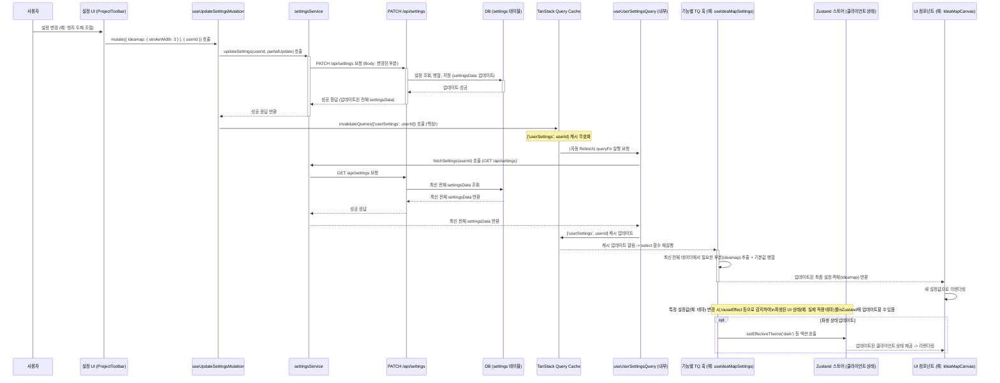

**1. E2E 다이어그램 (설정 변경 및 UI 업데이트 흐름)**

---

**목표:** 설정 관리 시스템 리팩토링 - DB를 서버 설정의 SSoT로, TanStack Query(RQ)를 클라이언트 측 서버 상태 관리자로, Zustand를 순수 클라이언트 UI 상태 관리자로 역할을 명확히 분담하고, 관련 버그를 해결한다.

---

**📌 Unit 1: 기본 설정 정의 및 DB 스키마 준비** `@layer config, DB`

*   **Task 1.1: 기본 설정 파일 정의 (`uiOptions.json`)**
    *   **수행:** `src/config/uiOptions.json` 파일을 생성하거나 기존 파일을 사용합니다.
    *   **내용:** 코드베이스 내 모든 기본 설정값(아이디어맵, 테마, 일반 등)을 `ideamap`, `theme`, `general` 등 명확한 최상위 키로 그룹화하여 정의합니다. 이 전체 객체를 `DEFAULT_SETTINGS` 상수로 export 합니다. (타입 정의 파일도 함께 생성/수정하는 것이 좋습니다.)
    *   **User Verification:** `uiOptions.json` 파일을 열어 구조가 논리적이고 필요한 모든 기본값이 포함되었는지 확인합니다.

*   **Task 1.2: Prisma 스키마 확인/수정 (`schema.prisma`)**
    *   **수행:** `prisma/schema.prisma` 파일을 열고 `Settings` 모델을 확인/수정합니다.
    *   **내용:** `userId String @unique @map("user_id")`와 `settingsData Json @default("{}") @map("settings_data")` 컬럼이 있는지 확인하고, 필요시 추가/수정합니다. `@map` 지시어를 사용하여 DB 컬럼명(snake_case)과 Prisma 필드명(camelCase)을 매핑합니다. `User` 모델과의 관계(`user User @relation(...)`)도 올바르게 설정되었는지 확인합니다.
    *   **실행:** 스키마 변경 시, 터미널에서 `npx prisma migrate dev --name update_settings_schema` 명령어를 실행하여 데이터베이스 마이그레이션을 적용합니다.
    *   **User Verification:** 마이그레이션 로그에 오류가 없는지 확인합니다. DB 클라이언트 도구(예: pgAdmin, DBeaver, Supabase Studio)를 사용하여 실제 `settings` 테이블의 구조가 스키마 정의와 일치하는지 확인합니다.

---

**📌 Unit 2: 백엔드 API 구현/수정** `@layer API`

*   **Task 2.1: 설정 조회 API 구현/수정 (`GET /api/settings`)**
    *   **수행:** `src/app/api/settings/route.ts` 파일의 `GET` 함수를 구현하거나 수정합니다.
    *   **내용:** 요청 사용자의 `userId`를 (예: `auth()` 헬퍼 사용) 확인하고, `prisma.settings.findUnique({ where: { userId } })`를 사용하여 해당 사용자의 `settingsData` JSON 컬럼 값을 조회합니다. 레코드가 없으면 빈 객체 `{}`를 반환하고, 찾으면 `settingsData` 값을 반환합니다. 반드시 인증/인가 로직을 포함하여 본인 설정만 조회 가능하도록 합니다.
    *   **User Verification:** API 테스트 도구(Postman, Insomnia, curl 등)를 사용하여 인증된 사용자로 `GET /api/settings` 요청을 보내고, 응답으로 `settingsData` JSON 객체 (또는 `{}`)가 오는지 확인합니다. DB에 직접 값을 넣고 조회하여 값이 올바르게 반환되는지 확인합니다.

*   **Task 2.2: 설정 수정 API 구현/수정 (`PATCH /api/settings`)**
    *   **수행:** `src/app/api/settings/route.ts` 파일의 `PATCH` 함수를 구현하거나 수정합니다.
    *   **내용:** 요청 body에서 `partialUpdate` 객체(예: `{ "ideamap": { "strokeWidth": 3 } }`)를 받습니다. `prisma.settings.findUnique`로 현재 DB의 `settingsData`를 가져옵니다(없으면 `{}` 사용). 가져온 객체와 `partialUpdate` 객체를 **깊은 병합(deep merge)**합니다. (주의: `Object.assign` 이나 `{...old, ...new}` 는 얕은 병합이므로 중첩 객체에 문제가 생길 수 있습니다. `lodash.merge` 같은 라이브러리 사용을 강력히 권장합니다.) 병합된 **전체** `settingsData` 객체를 `prisma.settings.update({ where: { userId }, data: { settingsData: mergedData } })`를 사용하여 DB에 저장합니다. 성공 시, **업데이트된 전체 `settingsData` 객체**를 응답으로 반환합니다. 인증/인가 로직을 포함합니다.
    *   **User Verification:** API 테스트 도구를 사용하여 `PATCH /api/settings` 요청을 보내고, 요청 본문에 일부 변경 사항(예: `{ "theme": { "mode": "dark" } }`)을 포함시킵니다. 응답으로 병합된 전체 설정 객체가 오는지 확인하고, DB 클라이언트 도구로 실제 `settingsData` 값이 올바르게 업데이트되었는지 확인합니다.

---

**📌 Unit 3: 서비스 계층 구현/수정** `@layer service`

*   **Task 3.1: 설정 서비스 함수 구현/수정 (`settingsService.ts`)**
    *   **수행:** `src/services/settingsService.ts` 파일을 구현하거나 수정합니다.
    *   **내용 (`fetchSettings`):** `GET /api/settings` API를 호출하는 비동기 함수를 구현합니다. API 응답(전체 `settingsData` JSON 객체 또는 `{}`)을 반환합니다.
    *   **내용 (`updateSettings`):** `PATCH /api/settings` API를 호출하는 비동기 함수를 구현합니다. `userId`와 `partialUpdate` 객체를 인자로 받아, `partialUpdate`를 요청 body로 전송합니다. API 응답(업데이트된 전체 `settingsData` 객체)을 반환합니다.
    *   **검증:** (선택적) 이 서비스 함수들에 대한 단위 테스트를 작성하거나, 이후 단계의 통합 테스트를 통해 검증합니다.

---

**📌 Unit 4: 데이터/상태 관리 계층 (React Query Hooks)** `@layer hook (TQ)`

*   **Task 4.1: Core Query Hook 생성 (`useUserSettingsQuery.ts`)**
    *   **수행:** `src/hooks/queries/` (또는 유사한 경로)에 `useUserSettingsQuery.ts` 파일을 생성합니다.
    *   **내용:** `useQuery`를 사용하여 `queryKey: ['userSettings', userId]`, `queryFn: () => fetchSettings(userId)`를 사용하는 기본 쿼리 훅을 구현합니다. `userId`가 없을 경우 쿼리가 비활성화되도록 `enabled: !!userId` 옵션을 추가합니다.
    *   **검증:** React Query DevTools(RQ DevTools)를 사용하여 `userSettings` 쿼리가 사용자 로그인 후 활성화되고 데이터를 성공적으로 가져오는지 확인합니다.

*   **Task 4.2: Feature Hook 수정 (`useIdeaMapSettings.ts`)**
    *   **수행:** `src/hooks/useIdeaMapSettings.ts` 파일을 수정합니다.
    *   **내용:** `useQuery`를 사용합니다. `queryKey`는 **동일하게 `['userSettings', userId]`**를 사용합니다. `queryFn`도 동일하게 `() => fetchSettings(userId)`를 사용하거나 내부적으로 `useUserSettingsQuery`의 결과를 사용해도 됩니다. **`select` 옵션을 추가**합니다. 이 `select` 함수는 `useUserSettingsQuery`가 반환한 전체 설정 데이터(`fullSettings`)를 받아, `fullSettings?.settingsData?.ideamap` 부분을 추출하고, `DEFAULT_SETTINGS.ideamap` (from `uiOptions.json`)과 병합하여 최종 `ideamap` 설정 객체만 반환하도록 구현합니다. (예: `select: (data) => ({ ...DEFAULT_SETTINGS.ideamap, ...(data?.settingsData?.ideamap || {}) })`)
    *   **User Verification:** 이 훅을 사용하는 컴포넌트(예: `ProjectToolbar`)에서 `console.log(settings)` 또는 React DevTools를 사용하여 훅이 반환하는 `data`가 올바르게 조합된 `ideamap` 설정 객체인지 확인합니다. DB에 값이 없을 때도 기본값이 잘 적용되는지 확인합니다.

*   **Task 4.3: Feature Hook 생성 (`useThemeSettings.ts` 등)**
    *   **수행:** `src/hooks/queries/` (또는 유사한 경로)에 `useThemeSettings.ts` 등 필요한 기능별 설정 훅 파일을 생성합니다.
    *   **내용:** Task 4.2와 동일한 패턴으로 구현합니다. `queryKey`는 `['userSettings', userId]`를 공유하고, `select` 옵션에서 해당 기능(예: `theme`) 부분을 추출하고 `DEFAULT_SETTINGS`의 해당 부분과 병합하여 반환합니다.
    *   **User Verification:** 이 훅을 사용하는 컴포넌트에서 반환되는 `data`를 확인합니다.

*   **Task 4.4: Mutation Hook 수정 (`useUpdateSettingsMutation.ts`)**
    *   **수행:** `src/hooks/useUpdateSettingsMutation.ts` (또는 기존 `useIdeaMapSettings.ts` 내부)를 수정합니다.
    *   **내용:** `useMutation`을 사용합니다. `mutationFn`이 `updateSettings(userId, partialUpdate)` 서비스 함수를 호출하도록 수정합니다. `onSuccess` 콜백에서 **반드시 `queryClient.invalidateQueries({ queryKey: ['userSettings', userId] })`** 를 호출하여 기본 쿼리 캐시를 무효화합니다. `onError` 콜백에서 사용자에게 피드백(예: `toast.error`)을 제공하는 로직을 추가합니다.
    *   **User Verification:** 설정을 변경하는 UI 액션을 수행합니다. RQ DevTools에서 Mutation이 성공/실패하는지, 성공 시 `userSettings` 쿼리가 `invalidated`되고 `fetching` 상태로 바뀌는지 확인합니다. 성공/실패 시 토스트 메시지가 뜨는지 확인합니다.

---

**📌 Unit 5: UI 계층 통합 및 수정** `@layer UI`

*   **Task 5.1: 설정 변경 UI 수정 (`ProjectToolbar.tsx` 등)**
    *   **수행:** `src/components/layout/ProjectToolbar.tsx` 등 설정을 변경하는 UI 컴포넌트를 수정합니다.
    *   **내용:** UI 이벤트 핸들러(예: `onValueChange`, `onCheckedChange`)에서 Task 4.4의 **Mutation 훅(`useUpdateSettingsMutation`)의 `mutate` 함수**를 호출합니다. 이때, **변경된 설정 부분만 포함하는 객체**를 `partialUpdate` 인자로 전달합니다. (예: `{ ideamap: { animated: newValue } }`). **Zustand 스토어의 설정 관련 상태를 직접 업데이트하는 코드는 제거합니다.** (단, 로딩 스피너 표시 등 순수 UI 피드백을 위한 로컬/Zustand 상태 관리는 가능합니다.)
    *   **User Verification:** UI에서 설정을 변경할 때, Network 탭에서 `PATCH /api/settings` 요청이 올바른 `partialUpdate` 본문과 함께 전송되는지 확인합니다.

*   **Task 5.2: 설정 사용 UI 수정 (`IdeaMapCanvas`, `CustomEdge` 등)**
    *   **수행:** 아이디어맵 렌더링과 관련된 컴포넌트 (`IdeaMapCanvas`, `CustomEdge`, `CardNode` 등)를 수정합니다.
    *   **내용:** `useAppStore`나 `useIdeaMapStore`에서 `ideaMapSettings` 객체를 가져오던 부분을 **`useIdeaMapSettings` 훅(Task 4.2)을 사용**하여 최종적으로 조합된 설정 객체를 가져오도록 수정합니다. 컴포넌트 내부에서 기본값과 병합하거나 조건부로 설정을 적용하던 로직이 있다면 제거합니다 (훅이 항상 완전한 객체를 제공하므로).
    *   **User Verification:** 설정을 변경했을 때(Task 5.1 수행 후), 아이디어맵의 관련 UI(예: 엣지 색상, 두께, 애니메이션 등)가 Mutation 성공 및 TQ Refetch 후 **자동으로 반영되는지 확인**합니다.

*   **Task 5.3: (해당 시) 다른 설정 사용 UI 수정 (`ThemeSwitcher` 등)**
    *   **수행:** 테마 등 다른 설정을 사용하는 UI 컴포넌트를 수정합니다.
    *   **내용:** 해당 기능의 **TQ Feature Hook (`useThemeSettings` 등)**을 사용하도록 수정합니다.
    *   **User Verification:** 관련 설정을 변경했을 때 UI가 올바르게 반영되는지 확인합니다.

*   **Task 5.4: (선택적) 파생된 클라이언트 상태 동기화 구현**
    *   **수행:** 필요하다면, TQ 훅의 결과를 기반으로 파생된 클라이언트 상태를 계산하고 Zustand 스토어를 업데이트하는 로직을 구현합니다.
    *   **내용:** 예: `useThemeSettings` 훅의 결과를 `useEffect`로 구독하여, 실제 OS 테마 설정과 조합한 후 최종 `effectiveTheme` ('light' 또는 'dark') 값을 계산하여 `useUIStore.setEffectiveTheme(...)` 같은 액션을 호출합니다.
    *   **User Verification:** 관련 서버 설정 변경 시 파생된 클라이언트 상태 및 이를 사용하는 UI가 올바르게 업데이트되는지 확인합니다.

---

**📌 Unit 6: 상태 관리 및 로컬 스토리지 정리** `@layer hook (Zustand), config`

*   **Task 6.1: Zustand 스토어 정리 (`useAppStore.ts`, `useIdeaMapStore.ts`)**
    *   **수행:** Zustand 스토어 정의 파일을 검토하고 수정합니다.
    *   **내용:** TQ가 관리하게 된 서버 상태 (예: `ideaMapSettings`) 관련 상태 변수와 액션을 스토어에서 **제거**합니다. 순수 클라이언트 UI 상태 (예: `isSidebarOpen`, `selectedCardIds`)만 남깁니다.
    *   **User Verification:** Zustand DevTools를 사용하여 스토어 상태를 검사하고, 불필요한 서버 상태가 완전히 제거되었는지 확인합니다. 기존에 해당 Zustand 상태를 사용하던 다른 컴포넌트들이 오류 없이 잘 동작하는지 확인합니다.

*   **Task 6.2: Zustand `persist` 미들웨어 설정 수정**
    *   **수행:** Zustand 스토어 정의 파일에서 `persist` 미들웨어 설정을 수정합니다.
    *   **내용:** `partialize` 옵션을 사용하여, TQ가 관리하는 서버 상태 관련 필드들이 로컬 스토리지에 저장되지 않도록 **명시적으로 제외**합니다. (오직 순수 클라이언트 상태 중 필요한 것만 저장하도록 설정)
    *   **User Verification:** 브라우저 개발자 도구 > Application > Local Storage 에서 관련 스토리지 키의 값을 확인하여, 제외된 서버 상태가 더 이상 저장되지 않는지 확인합니다. 페이지 새로고침 후에도 저장하기로 설정한 클라이언트 상태는 복원되고, 서버 상태는 TQ를 통해 정상적으로 로드되는지 확인합니다.

---

**📌 Unit 7: 최종 테스트 및 코드 정리** `@layer test, code`

*   **Task 7.1: End-to-End (E2E) 테스트 수행**
    *   **수행:** 애플리케이션을 사용자의 관점에서 직접 테스트합니다.
    *   **내용:**
        *   다양한 설정(엣지 스타일, 테마 등)을 변경하고 UI에 즉시 반영되는지 확인합니다.
        *   페이지를 새로고침한 후에도 변경된 설정이 올바르게 유지되는지 확인합니다.
        *   설정 변경이 다른 기능(카드 CRUD, 노드/엣지 조작 등)에 부정적인 영향을 미치지 않는지 확인합니다.
        *   여러 브라우저 탭에서 동시에 설정을 변경했을 때 (가능하다면) 상태 동기화가 TQ를 통해 잘 이루어지는지 확인합니다. (TQ의 기본 refetch 기능)
    *   **User Verification:** 모든 기능이 예상대로 원활하게 작동하는지 최종 검증합니다.

*   **Task 7.2: 코드 정리 및 리뷰**
    *   **수행:** 리팩토링 과정에서 추가된 모든 디버깅용 `console.log` 구문을 제거합니다.
    *   **내용:** 코드 포맷팅을 실행하고, 불필요한 주석을 정리합니다. 변경된 파일들에 대해 동료 개발자의 코드 리뷰를 요청하거나 스스로 재검토합니다.
    *   **검증:** 코드가 깔끔하고 일관성 있는지, 잠재적인 오류가 없는지 확인합니다.