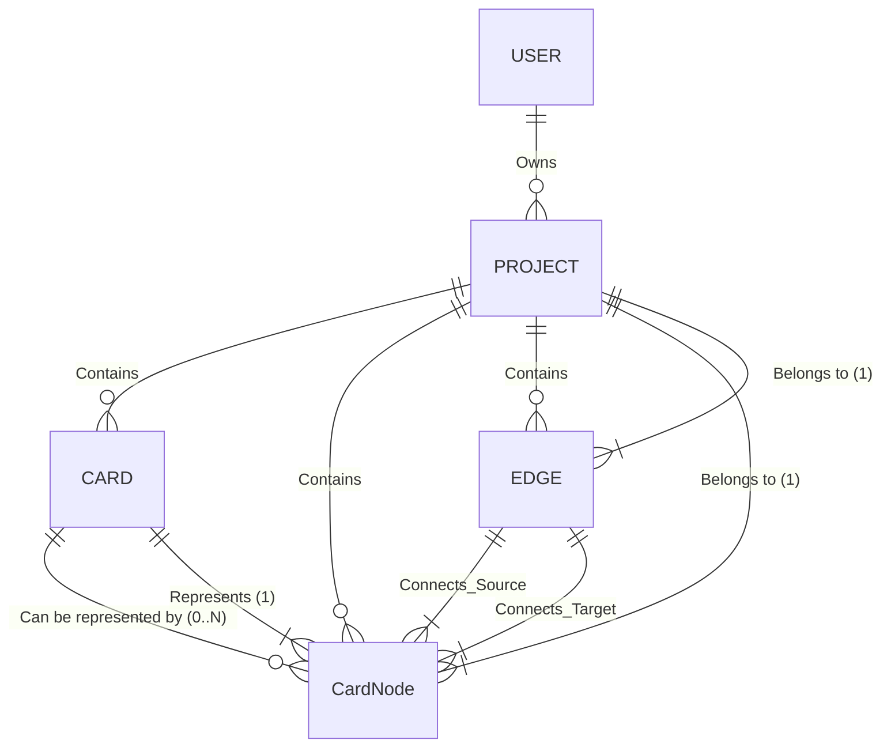

```mermaid
erDiagram
    USER ||--o{ PROJECT : Owns
    PROJECT ||--o{ CARD : Contains
    PROJECT ||--o{ CardNode : Contains
    PROJECT ||--o{ EDGE : Contains
    CARD ||--o{ CardNode : "Can be represented by (0..N)"
    CardNode }|--|| CARD : "Represents (1)"
    CardNode }|--|| PROJECT : "Belongs to (1)"
    EDGE }|--|| PROJECT : "Belongs to (1)"
    EDGE ||--|{ CardNode : Connects_Source
    EDGE ||--|{ CardNode : Connects_Target

    %% Optional: Sharing relationship %%
    %% USER ||--o{ PROJECT_MEMBER : MemberOf %%
    %% PROJECT ||--o{ PROJECT_MEMBER : HasMember %%
```