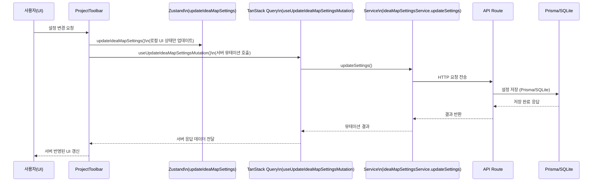

```mermaid
sequenceDiagram
    participant UI as 사용자(UI)
    participant PT as ProjectToolbar
    participant ZD as Zustand\n(updateIdeaMapSettings)
    participant TQ as TanStack Query\n(useUpdateIdeaMapSettingsMutation)
    participant SVC as Service\n(ideaMapSettingsService.updateSettings)
    participant API as API Route
    participant DB as Prisma/SQLite

    UI->>PT: 설정 변경 요청
    PT->>ZD: updateIdeaMapSettings()\n(로컬 UI 상태만 업데이트)
    PT->>TQ: useUpdateIdeaMapSettingsMutation()\n(서버 뮤테이션 호출)
    TQ->>SVC: updateSettings()
    SVC->>API: HTTP 요청 전송
    API->>DB: 설정 저장 (Prisma/SQLite)
    DB-->>API: 저장 완료 응답
    API-->>SVC: 결과 반환
    SVC-->>TQ: 뮤테이션 결과
    TQ-->>PT: 서버 응답 데이터 전달
    PT-->>UI: 서버 반영된 UI 갱신
```