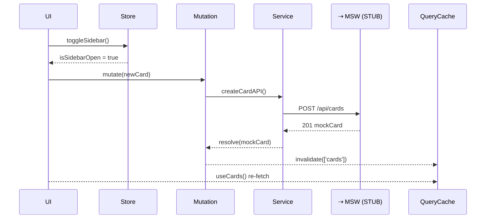

```mermaid
sequenceDiagram
  participant UI
  participant Store
  participant Mutation
  participant Service
  participant MSW as ⇢ MSW (STUB)

  UI->>Store: toggleSidebar()
  Store-->>UI: isSidebarOpen = true

  UI->>Mutation: mutate(newCard)
  Mutation->>Service: createCardAPI()
  Service->>MSW: POST /api/cards
  MSW-->>Service: 201 mockCard
  Service-->>Mutation: resolve(mockCard)
  Mutation-->>QueryCache: invalidate(['cards'])
  UI-->>QueryCache: useCards() re-fetch
```

```mermaid
graph TD
  UI["React Component"] -->|dispatch| ZS["Zustand Slice (UI command)"]
  ZS -->|call| MUT["useCreateCard<br/>TanStack Mutation"]
  MUT -->|uses| SVC["cardService.createCardAPI"]
  SVC -->|fetch| API["/api/cards (route)"]
  API -->|DB| Prisma[(Supabase)]
  
  classDef store fill:#525252,stroke:#555;
  classDef svc   fill:#222222,stroke:#555;
  class ZS store;
  class SVC svc;
```