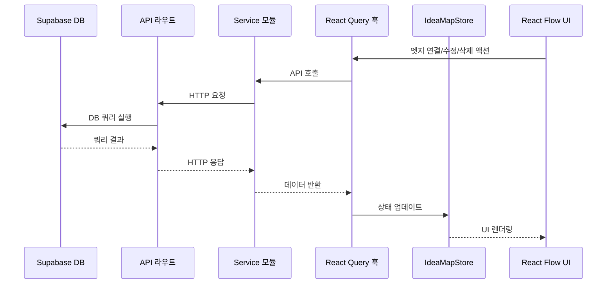

# 엣지 데이터 Supabase DB 저장 마이그레이션 Tasklist

## A. 데이터 모델 및 서비스 레이어 구축

### Task 1: 엣지 데이터 모델 및 타입 정의
- **관련 파일:** `/src/types/edge.ts` (신규)
- **변경 유형:** [✅코드 추가]
- **설명:** 엣지 관련 타입 정의 (API 및 DB 상호작용용)
- **함수 시그니처:** 
```ts
// DB에 저장되는 엣지 데이터 타입
export interface Edge {
  id: string;          // 기본 키
  source: string;      // 시작 노드 ID (카드 ID)
  target: string;      // 도착 노드 ID (카드 ID)
  sourceHandle?: string; // 시작 노드의 연결점 (선택사항)
  targetHandle?: string; // 도착 노드의 연결점 (선택사항)
  type: string;        // 엣지 타입 ('default', 'straight', 'bezier', 'step' 등)
  animated: boolean;   // 애니메이션 여부
  style?: any;         // 스타일 속성 (JSON 형태로 저장)
  data?: any;          // 추가 데이터 (관계 타입 등, JSON 형태로 저장)
  userId: string;      // 소유자 ID (인증)
  createdAt: string;   // 생성 시간
  updatedAt: string;   // 업데이트 시간
}

// API 요청용 (생성/수정)
export interface EdgeInput {
  source: string;
  target: string;
  sourceHandle?: string;
  targetHandle?: string;
  type?: string;
  animated?: boolean;
  style?: any;
  data?: any;
}

// API 응답용 (부분 업데이트)
export interface EdgePatch {
  id: string;
  source?: string;
  target?: string;
  sourceHandle?: string;
  targetHandle?: string;
  type?: string;
  animated?: boolean;
  style?: any;
  data?: any;
}

// ReactFlow 표현용 (프론트엔드 전용)
export interface ReactFlowEdge extends Omit<Edge, 'userId' | 'createdAt' | 'updatedAt'> {
  markerEnd?: string;
  selected?: boolean;
}

// EdgeInput → Edge 변환
export function toEdge(input: EdgeInput, userId: string): Omit<Edge, 'id' | 'createdAt' | 'updatedAt'> {
  return {
    source: input.source,
    target: input.target,
    sourceHandle: input.sourceHandle,
    targetHandle: input.targetHandle,
    type: input.type || 'default',
    animated: input.animated || false,
    style: input.style || {},
    data: input.data || {},
    userId
  };
}

// Edge → ReactFlowEdge 변환
export function toReactFlowEdge(edge: Edge): ReactFlowEdge {
  const { userId, createdAt, updatedAt, ...baseEdge } = edge;
  return {
    ...baseEdge,
    // ReactFlow 특화 속성 추가
    markerEnd: edge.data?.markerEnd || 'arrow',
    selected: false
  };
}
```
- **import 경로 변경:** N/A (신규 파일)
- **적용 규칙:** [layer-separation]
- **예상 결과:** 엣지 데이터 모델이 명확하게 정의되어 타입 안전성이 보장됨

### Task 2: Supabase DB 엣지 테이블 정의 및 마이그레이션
- **관련 파일:** `/supabase/migrations/xxxx_create_edges_table.sql` (신규)
- **변경 유형:** [✅코드 추가]
- **설명:** Supabase DB에 edges 테이블 생성 SQL 작성
- **함수 시그니처:** 
```sql
-- edges 테이블 생성
CREATE TABLE IF NOT EXISTS edges (
  id UUID PRIMARY KEY DEFAULT uuid_generate_v4(),
  source UUID NOT NULL REFERENCES cards(id) ON DELETE CASCADE,
  target UUID NOT NULL REFERENCES cards(id) ON DELETE CASCADE,
  source_handle TEXT,
  target_handle TEXT,
  type TEXT NOT NULL DEFAULT 'default',
  animated BOOLEAN NOT NULL DEFAULT false,
  style JSONB,
  data JSONB,
  user_id UUID NOT NULL REFERENCES auth.users(id) ON DELETE CASCADE,
  created_at TIMESTAMP WITH TIME ZONE DEFAULT now(),
  updated_at TIMESTAMP WITH TIME ZONE DEFAULT now()
);

-- 인덱스 생성
CREATE INDEX IF NOT EXISTS idx_edges_source ON edges(source);
CREATE INDEX IF NOT EXISTS idx_edges_target ON edges(target);
CREATE INDEX IF NOT EXISTS idx_edges_user_id ON edges(user_id);

-- RLS 설정
ALTER TABLE edges ENABLE ROW LEVEL SECURITY;

-- 누구나 조회 가능 (카드처럼)
CREATE POLICY "모든 사용자가 엣지를 볼 수 있음" ON edges
  FOR SELECT USING (true);

-- 소유자만 생성/수정/삭제 가능
CREATE POLICY "인증된 사용자만 엣지를 생성할 수 있음" ON edges
  FOR INSERT WITH CHECK (auth.uid() = user_id);

CREATE POLICY "소유자만 엣지를 수정할 수 있음" ON edges
  FOR UPDATE USING (auth.uid() = user_id);

CREATE POLICY "소유자만 엣지를 삭제할 수 있음" ON edges
  FOR DELETE USING (auth.uid() = user_id);

-- 트리거: 업데이트 시간 자동 갱신
CREATE OR REPLACE FUNCTION update_edges_updated_at()
RETURNS TRIGGER AS $$
BEGIN
  NEW.updated_at = now();
  RETURN NEW;
END;
$$ LANGUAGE plpgsql;

CREATE TRIGGER edges_updated_at
BEFORE UPDATE ON edges
FOR EACH ROW
EXECUTE FUNCTION update_edges_updated_at();
```
- **import 경로 변경:** N/A
- **적용 규칙:** [supabase-db-migration]
- **예상 결과:** Supabase 프로젝트에 edges 테이블 생성 및 RLS 설정

### Task 3: 엣지 서비스 모듈 생성
- **관련 파일:** `/src/services/edgeService.ts` (신규)
- **변경 유형:** [✅코드 추가]
- **설명:** 엣지 관련 API 통신 함수들 구현 (CRUD)
- **함수 시그니처:** 
```ts
/**
 * 파일명: src/services/edgeService.ts
 * 목적: 엣지 관련 API 통신 서비스
 * 역할: 엣지 데이터의 CRUD 작업을 위한 API 호출 함수 제공
 * 작성일: YYYY-MM-DD
 * @rule   three-layer-standard
 * @layer  service
 * @tag    @service-msw fetchEdges
 */

import createLogger from '@/lib/logger';
import { Edge, EdgeInput, EdgePatch } from '@/types/edge';

const logger = createLogger('edgeService');

/**
 * fetchEdges: 모든 엣지 목록 또는 필터링된 엣지 조회
 * @param {Object} params - 필터링 파라미터
 * @returns {Promise<Edge[]>} 엣지 목록
 */
export async function fetchEdges(
  params?: { source?: string; target?: string; userId?: string }
): Promise<Edge[]> {
  try {
    // 쿼리 파라미터 생성
    const queryParams = new URLSearchParams();
    if (params?.source) queryParams.append('source', params.source);
    if (params?.target) queryParams.append('target', params.target);
    if (params?.userId) queryParams.append('userId', params.userId);
    
    const queryString = queryParams.toString();
    const url = `/api/edges${queryString ? `?${queryString}` : ''}`;
    
    const response = await fetch(url);
    
    if (!response.ok) {
      throw new Error(response.statusText || '엣지 목록을 가져오는 중 오류가 발생했습니다.');
    }
    
    return await response.json();
  } catch (error) {
    logger.error('엣지 목록 조회 오류:', error);
    throw error;
  }
}

/**
 * fetchEdgeById: 특정 ID의 엣지 조회
 * @param {string} id - 엣지 ID
 * @returns {Promise<Edge>} 엣지 데이터
 */
export async function fetchEdgeById(id: string): Promise<Edge> {
  try {
    const response = await fetch(`/api/edges/${id}`);
    
    if (!response.ok) {
      throw new Error(response.statusText || '엣지를 가져오는 중 오류가 발생했습니다.');
    }
    
    return await response.json();
  } catch (error) {
    logger.error(`엣지 조회 오류 (ID=${id}):`, error);
    throw error;
  }
}

/**
 * createEdgeAPI: 새 엣지 생성
 * @param {EdgeInput | EdgeInput[]} input - 생성할 엣지 데이터(단일 또는 배열)
 * @returns {Promise<Edge[]>} 생성된 엣지 정보
 */
export async function createEdgeAPI(input: EdgeInput | EdgeInput[]): Promise<Edge[]> {
  try {
    const response = await fetch('/api/edges', {
      method: 'POST',
      headers: {
        'Content-Type': 'application/json',
      },
      body: JSON.stringify(input),
    });
    
    if (!response.ok) {
      throw new Error(response.statusText || '엣지 생성 중 오류가 발생했습니다.');
    }
    
    return await response.json();
  } catch (error) {
    logger.error('엣지 생성 오류:', error);
    throw error;
  }
}

/**
 * updateEdgeAPI: 엣지 업데이트
 * @param {string} id - 업데이트할 엣지 ID
 * @param {EdgePatch} patch - 업데이트할 속성
 * @returns {Promise<Edge>} 업데이트된 엣지 정보
 */
export async function updateEdgeAPI(id: string, patch: Partial<EdgePatch>): Promise<Edge> {
  try {
    const response = await fetch(`/api/edges/${id}`, {
      method: 'PATCH',
      headers: {
        'Content-Type': 'application/json',
      },
      body: JSON.stringify(patch),
    });
    
    if (!response.ok) {
      throw new Error(response.statusText || '엣지 업데이트 중 오류가 발생했습니다.');
    }
    
    return await response.json();
  } catch (error) {
    logger.error(`엣지 업데이트 오류 (ID=${id}):`, error);
    throw error;
  }
}

/**
 * deleteEdgeAPI: 엣지 삭제
 * @param {string} id - 삭제할 엣지 ID
 * @returns {Promise<void>}
 */
export async function deleteEdgeAPI(id: string): Promise<void> {
  try {
    const response = await fetch(`/api/edges/${id}`, {
      method: 'DELETE',
    });
    
    if (!response.ok) {
      throw new Error(response.statusText || '엣지 삭제 중 오류가 발생했습니다.');
    }
  } catch (error) {
    logger.error(`엣지 삭제 오류 (ID=${id}):`, error);
    throw error;
  }
}

/**
 * deleteEdgesAPI: 다중 엣지 삭제
 * @param {string[]} ids - 삭제할 엣지 ID 배열
 * @returns {Promise<void>}
 */
export async function deleteEdgesAPI(ids: string[]): Promise<void> {
  try {
    const idParam = ids.join(',');
    const response = await fetch(`/api/edges?ids=${idParam}`, {
      method: 'DELETE',
    });
    
    if (!response.ok) {
      throw new Error(response.statusText || '엣지 일괄 삭제 중 오류가 발생했습니다.');
    }
  } catch (error) {
    logger.error(`엣지 일괄 삭제 오류:`, error);
    throw error;
  }
}
```
- **import 경로 변경:** N/A (신규 파일)
- **적용 규칙:** [service-msw], [layer-separation]
- **예상 결과:** 엣지 CRUD 작업을 위한 API 서비스 함수 완성

## B. API 라우트 구현

### Task 4: 엣지 목록 API 구현 (GET, POST)
- **관련 파일:** `/src/app/api/edges/route.ts` (신규)
- **변경 유형:** [✅코드 추가]
- **설명:** 엣지 목록 조회 및 생성 API 엔드포인트 구현
- **함수 시그니처:** 
```ts
/**
 * 파일명: src/app/api/edges/route.ts
 * 목적: 엣지 목록 조회 및 생성을 위한 API 라우트
 * 역할: GET /api/edges, POST /api/edges, DELETE /api/edges?ids=...
 * 작성일: YYYY-MM-DD
 * @rule   three-layer-standard
 * @layer  service
 * @tag    @service-msw edgesAPI
 */

import { NextRequest, NextResponse } from 'next/server';
import { z } from 'zod';

import { getUserFromRequest } from '@/lib/auth-server';
import { supabase } from '@/lib/supabase-server';
import { EdgeInput, toEdge } from '@/types/edge';

// 유효성 검증 스키마
const EdgeInputSchema = z.object({
  source: z.string().uuid(),
  target: z.string().uuid(),
  sourceHandle: z.string().optional(),
  targetHandle: z.string().optional(),
  type: z.string().optional(),
  animated: z.boolean().optional(),
  style: z.any().optional(),
  data: z.any().optional()
});

// GET /api/edges - 엣지 목록 조회
export async function GET(request: NextRequest) {
  try {
    const { searchParams } = new URL(request.url);
    const source = searchParams.get('source');
    const target = searchParams.get('target');
    const userId = searchParams.get('userId');
    
    // Supabase 쿼리 빌더
    let query = supabase.from('edges').select('*');
    
    // 검색 파라미터 적용
    if (source) {
      query = query.eq('source', source);
    }
    if (target) {
      query = query.eq('target', target);
    }
    if (userId) {
      query = query.eq('user_id', userId);
    }
    
    // 결과 가져오기
    const { data, error } = await query.order('created_at', { ascending: false });
    
    if (error) {
      console.error('엣지 목록 조회 오류:', error);
      return NextResponse.json(
        { error: '엣지 목록을 가져오는 중 오류가 발생했습니다.' }, 
        { status: 500 }
      );
    }
    
    // 카멜케이스로 변환
    const formattedData = data.map(edge => ({
      id: edge.id,
      source: edge.source,
      target: edge.target,
      sourceHandle: edge.source_handle,
      targetHandle: edge.target_handle,
      type: edge.type,
      animated: edge.animated,
      style: edge.style,
      data: edge.data,
      userId: edge.user_id,
      createdAt: edge.created_at,
      updatedAt: edge.updated_at
    }));
    
    return NextResponse.json(formattedData);
  } catch (error) {
    console.error('엣지 목록 API 오류:', error);
    return NextResponse.json(
      { error: '서버 오류가 발생했습니다.' }, 
      { status: 500 }
    );
  }
}

// POST /api/edges - 엣지 생성
export async function POST(request: NextRequest) {
  try {
    // 사용자 인증 확인
    const user = await getUserFromRequest(request);
    if (!user) {
      return NextResponse.json(
        { error: '인증되지 않은 요청입니다.' }, 
        { status: 401 }
      );
    }
    
    // 요청 본문 파싱
    const body = await request.json();
    
    // 단일 또는 배열 처리
    const inputsArray = Array.isArray(body) ? body : [body];
    
    // 각 입력 유효성 검증
    const validationResults = inputsArray.map(input => 
      EdgeInputSchema.safeParse(input)
    );
    
    // 유효성 검사 실패 항목 확인
    const invalidInputs = validationResults
      .map((result, index) => result.success ? null : { index, error: result.error })
      .filter(Boolean);
    
    if (invalidInputs.length > 0) {
      return NextResponse.json(
        { error: '잘못된 엣지 데이터 형식입니다.', details: invalidInputs }, 
        { status: 400 }
      );
    }
    
    // DB에 저장할 데이터 변환
    const edgesToInsert = inputsArray.map(input => {
      const edgeData = toEdge(input, user.id);
      return {
        source: edgeData.source,
        target: edgeData.target,
        source_handle: edgeData.sourceHandle,
        target_handle: edgeData.targetHandle,
        type: edgeData.type,
        animated: edgeData.animated,
        style: edgeData.style,
        data: edgeData.data,
        user_id: edgeData.userId
      };
    });
    
    // DB에 저장
    const { data, error } = await supabase
      .from('edges')
      .insert(edgesToInsert)
      .select();
    
    if (error) {
      console.error('엣지 생성 오류:', error);
      
      // 외래 키 제약 에러 처리
      if (error.code === '23503') {
        return NextResponse.json(
          { error: '참조하는 카드가 존재하지 않습니다.' }, 
          { status: 400 }
        );
      }
      
      return NextResponse.json(
        { error: '엣지를 생성하는 중 오류가 발생했습니다.' }, 
        { status: 500 }
      );
    }
    
    // 카멜케이스로 변환
    const formattedData = data.map(edge => ({
      id: edge.id,
      source: edge.source,
      target: edge.target,
      sourceHandle: edge.source_handle,
      targetHandle: edge.target_handle,
      type: edge.type,
      animated: edge.animated,
      style: edge.style,
      data: edge.data,
      userId: edge.user_id,
      createdAt: edge.created_at,
      updatedAt: edge.updated_at
    }));
    
    return NextResponse.json(formattedData, { status: 201 });
  } catch (error) {
    console.error('엣지 생성 API 오류:', error);
    return NextResponse.json(
      { error: '서버 오류가 발생했습니다.' }, 
      { status: 500 }
    );
  }
}

// DELETE /api/edges?ids=id1,id2,... - 다중 엣지 삭제
export async function DELETE(request: NextRequest) {
  try {
    // 사용자 인증 확인
    const user = await getUserFromRequest(request);
    if (!user) {
      return NextResponse.json(
        { error: '인증되지 않은 요청입니다.' }, 
        { status: 401 }
      );
    }
    
    const { searchParams } = new URL(request.url);
    const idsParam = searchParams.get('ids');
    
    if (!idsParam) {
      return NextResponse.json(
        { error: '삭제할 엣지 ID를 지정해야 합니다.' }, 
        { status: 400 }
      );
    }
    
    const ids = idsParam.split(',');
    
    // 소유권 확인 및 삭제
    const { error } = await supabase
      .from('edges')
      .delete()
      .in('id', ids)
      .eq('user_id', user.id);
    
    if (error) {
      console.error('엣지 일괄 삭제 오류:', error);
      return NextResponse.json(
        { error: '엣지를 삭제하는 중 오류가 발생했습니다.' }, 
        { status: 500 }
      );
    }
    
    return new NextResponse(null, { status: 204 });
  } catch (error) {
    console.error('엣지 일괄 삭제 API 오류:', error);
    return NextResponse.json(
      { error: '서버 오류가 발생했습니다.' }, 
      { status: 500 }
    );
  }
}
```
- **import 경로 변경:** N/A (신규 파일)
- **적용 규칙:** [service-msw], [layer-separation]
- **예상 결과:** 엣지 목록 조회, 생성, 일괄 삭제 API 구현 완료

### Task 5: 엣지 상세 API 구현 (GET, PATCH, DELETE)
- **관련 파일:** `/src/app/api/edges/[id]/route.ts` (신규)
- **변경 유형:** [✅코드 추가]
- **설명:** 단일 엣지 조회, 수정, 삭제 API 엔드포인트 구현
- **함수 시그니처:**
```ts
/**
 * 파일명: src/app/api/edges/[id]/route.ts
 * 목적: 개별 엣지 조회, 수정, 삭제를 위한 API 라우트
 * 역할: GET, PATCH, DELETE /api/edges/:id
 * 작성일: YYYY-MM-DD
 * @rule   three-layer-standard
 * @layer  service
 * @tag    @service-msw edgeAPI
 */

import { NextRequest, NextResponse } from 'next/server';
import { z } from 'zod';

import { getUserFromRequest } from '@/lib/auth-server';
import { supabase } from '@/lib/supabase-server';

// 유효성 검증 스키마
const EdgePatchSchema = z.object({
  source: z.string().uuid().optional(),
  target: z.string().uuid().optional(),
  sourceHandle: z.string().optional(),
  targetHandle: z.string().optional(),
  type: z.string().optional(),
  animated: z.boolean().optional(),
  style: z.any().optional(),
  data: z.any().optional()
});

// GET /api/edges/:id - 개별 엣지 조회
export async function GET(
  request: NextRequest,
  { params }: { params: { id: string } }
) {
  try {
    const id = params.id;
    
    const { data, error } = await supabase
      .from('edges')
      .select('*')
      .eq('id', id)
      .single();
    
    if (error) {
      if (error.code === 'PGRST116') {
        return NextResponse.json(
          { error: '엣지를 찾을 수 없습니다.' }, 
          { status: 404 }
        );
      }
      
      console.error(`엣지 조회 오류 (ID=${id}):`, error);
      return NextResponse.json(
        { error: '엣지를 가져오는 중 오류가 발생했습니다.' }, 
        { status: 500 }
      );
    }
    
    // 카멜케이스로 변환
    const formattedData = {
      id: data.id,
      source: data.source,
      target: data.target,
      sourceHandle: data.source_handle,
      targetHandle: data.target_handle,
      type: data.type,
      animated: data.animated,
      style: data.style,
      data: data.data,
      userId: data.user_id,
      createdAt: data.created_at,
      updatedAt: data.updated_at
    };
    
    return NextResponse.json(formattedData);
  } catch (error) {
    console.error(`엣지 조회 API 오류:`, error);
    return NextResponse.json(
      { error: '서버 오류가 발생했습니다.' }, 
      { status: 500 }
    );
  }
}

// PATCH /api/edges/:id - 엣지 수정
export async function PATCH(
  request: NextRequest,
  { params }: { params: { id: string } }
) {
  try {
    // 사용자 인증 확인
    const user = await getUserFromRequest(request);
    if (!user) {
      return NextResponse.json(
        { error: '인증되지 않은 요청입니다.' }, 
        { status: 401 }
      );
    }
    
    const id = params.id;
    
    // 소유권 확인
    const { data: existingEdge, error: fetchError } = await supabase
      .from('edges')
      .select('user_id')
      .eq('id', id)
      .single();
    
    if (fetchError) {
      if (fetchError.code === 'PGRST116') {
        return NextResponse.json(
          { error: '엣지를 찾을 수 없습니다.' }, 
          { status: 404 }
        );
      }
      
      console.error(`엣지 확인 오류 (ID=${id}):`, fetchError);
      return NextResponse.json(
        { error: '엣지를 확인하는 중 오류가 발생했습니다.' }, 
        { status: 500 }
      );
    }
    
    if (existingEdge.user_id !== user.id) {
      return NextResponse.json(
        { error: '이 엣지를 수정할 권한이 없습니다.' }, 
        { status: 403 }
      );
    }
    
    // 요청 본문 파싱 및 유효성 검사
    const body = await request.json();
    const validationResult = EdgePatchSchema.safeParse(body);
    
    if (!validationResult.success) {
      return NextResponse.json(
        { 
          error: '잘못된 엣지 데이터 형식입니다.', 
          details: validationResult.error.format() 
        }, 
        { status: 400 }
      );
    }
    
    const patch = validationResult.data;
    
    // 스네이크 케이스로 변환
    const updateData: any = {};
    if (patch.source) updateData.source = patch.source;
    if (patch.target) updateData.target = patch.target;
    if (patch.sourceHandle !== undefined) updateData.source_handle = patch.sourceHandle;
    if (patch.targetHandle !== undefined) updateData.target_handle = patch.targetHandle;
    if (patch.type !== undefined) updateData.type = patch.type;
    if (patch.animated !== undefined) updateData.animated = patch.animated;
    if (patch.style !== undefined) updateData.style = patch.style;
    if (patch.data !== undefined) updateData.data = patch.data;
    
    // DB 업데이트
    const { data, error } = await supabase
      .from('edges')
      .update(updateData)
      .eq('id', id)
      .select()
      .single();
    
    if (error) {
      console.error(`엣지 업데이트 오류 (ID=${id}):`, error);
      
      // 외래 키 제약 에러 처리
      if (error.code === '23503') {
        return NextResponse.json(
          { error: '참조하는 카드가 존재하지 않습니다.' }, 
          { status: 400 }
        );
      }
      
      return NextResponse.json(
        { error: '엣지를 업데이트하는 중 오류가 발생했습니다.' }, 
        { status: 500 }
      );
    }
    
    // 카멜케이스로 변환
    const formattedData = {
      id: data.id,
      source: data.source,
      target: data.target,
      sourceHandle: data.source_handle,
      targetHandle: data.target_handle,
      type: data.type,
      animated: data.animated,
      style: data.style,
      data: data.data,
      userId: data.user_id,
      createdAt: data.created_at,
      updatedAt: data.updated_at
    };
    
    return NextResponse.json(formattedData);
  } catch (error) {
    console.error(`엣지 업데이트 API 오류:`, error);
    return NextResponse.json(
      { error: '서버 오류가 발생했습니다.' }, 
      { status: 500 }
    );
  }
}

// DELETE /api/edges/:id - 엣지 삭제
export async function DELETE(
  request: NextRequest,
  { params }: { params: { id: string } }
) {
  try {
    // 사용자 인증 확인
    const user = await getUserFromRequest(request);
    if (!user) {
      return NextResponse.json(
        { error: '인증되지 않은 요청입니다.' }, 
        { status: 401 }
      );
    }
    
    const id = params.id;
    
    // 소유권 확인 및 삭제
    const { error } = await supabase
      .from('edges')
      .delete()
      .eq('id', id)
      .eq('user_id', user.id);
    
    if (error) {
      console.error(`엣지 삭제 오류 (ID=${id}):`, error);
      return NextResponse.json(
        { error: '엣지를 삭제하는 중 오류가 발생했습니다.' }, 
        { status: 500 }
      );
    }
    
    return new NextResponse(null, { status: 204 });
  } catch (error) {
    console.error(`엣지 삭제 API 오류:`, error);
    return NextResponse.json(
      { error: '서버 오류가 발생했습니다.' }, 
      { status: 500 }
    );
  }
}
```
- **import 경로 변경:** N/A (신규 파일)
- **적용 규칙:** [service-msw], [layer-separation]
- **예상 결과:** 특정 엣지 조회, 수정, 삭제 API 구현 완료

## C. React Query 훅 구현

### Task 6: `useEdges` 엣지 목록 조회 훅 구현
- **관련 파일:** `/src/hooks/useEdges.ts` (신규)
- **변경 유형:** [✅코드 추가]
- **설명:** 엣지 목록을 가져오는 React Query 훅 구현
- **함수 시그니처:**
```ts
/**
 * 파일명: src/hooks/useEdges.ts
 * 목적: 엣지 목록 조회 React Query 훅
 * 역할: 엣지 목록을 가져오고 캐싱하는 훅 제공
 * 작성일: YYYY-MM-DD
 * @rule   three-layer-standard
 * @layer  tanstack-query-hook
 * @tag    @tanstack-query-msw fetchEdges
 */

import { useQuery, UseQueryOptions, UseQueryResult } from '@tanstack/react-query';
import { fetchEdges, Edge } from '@/services/edgeService';

/**
 * useEdges: 엣지 목록을 조회하는 훅
 * @param params - 필터링 파라미터 (source, target, userId)
 * @param options - useQuery 추가 옵션 (선택사항)
 * @returns 엣지 목록 쿼리 결과 (data, isLoading, error 등)
 */
export function useEdges(
  params?: { source?: string; target?: string; userId?: string },
  options?: Omit<UseQueryOptions<Edge[], Error>, 'queryKey' | 'queryFn'>
): UseQueryResult<Edge[], Error> {
  return useQuery({
    queryKey: ['edges', params],
    queryFn: () => fetchEdges(params),
    staleTime: 1000 * 60 * 5, // 5분 동안 데이터를 "신선"하게 유지 (불필요한 재요청 방지)
    ...options,
  });
}
```
- **import 경로 변경:** N/A (신규 파일)
- **적용 규칙:** [tanstack-query-hook], [query-key]
- **예상 결과:** 엣지 목록을 조회하고 캐싱하는 React Query 훅 완성

### Task 7: `useEdge` 단일 엣지 조회 훅 구현
- **관련 파일:** `/src/hooks/useEdge.ts` (신규)
- **변경 유형:** [✅코드 추가]
- **설명:** 특정 ID의 엣지를 가져오는 React Query 훅 구현
- **함수 시그니처:**
```ts
/**
 * 파일명: src/hooks/useEdge.ts
 * 목적: 단일 엣지 조회 React Query 훅
 * 역할: 특정 ID의 엣지를 가져오고 캐싱하는 훅 제공
 * 작성일: YYYY-MM-DD
 * @rule   three-layer-standard
 * @layer  tanstack-query-hook
 * @tag    @tanstack-query-msw fetchEdgeById
 */

import { useQuery, UseQueryOptions, UseQueryResult } from '@tanstack/react-query';
import { fetchEdgeById, Edge } from '@/services/edgeService';

/**
 * useEdge: 특정 ID의 엣지를 조회하는 훅
 * @param edgeId - 조회할 엣지 ID (없으면 비활성화)
 * @param options - useQuery 추가 옵션 (선택사항)
 * @returns 특정 엣지 쿼리 결과 (data, isLoading, error 등)
 */
export function useEdge(
  edgeId?: string,
  options?: Omit<UseQueryOptions<Edge, Error>, 'queryKey' | 'queryFn' | 'enabled'>
): UseQueryResult<Edge, Error> {
  return useQuery({
    queryKey: ['edge', edgeId],
    queryFn: () => fetchEdgeById(edgeId!),
    enabled: !!edgeId, // edgeId가 있을 때만 활성화
    ...options,
  });
}
```
- **import 경로 변경:** N/A (신규 파일)
- **적용 규칙:** [tanstack-query-hook], [query-key]
- **예상 결과:** 특정 엣지를 조회하고 캐싱하는 React Query 훅 완성

### Task 8: `useCreateEdge` 엣지 생성 Mutation 훅 구현
- **관련 파일:** `/src/hooks/useCreateEdge.ts` (신규)
- **변경 유형:** [✅코드 추가]
- **설명:** 새 엣지를 생성하는 React Query Mutation 훅 구현
- **함수 시그니처:**
```ts
/**
 * 파일명: src/hooks/useCreateEdge.ts
 * 목적: 엣지 생성 React Query Mutation 훅
 * 역할: 새 엣지를 생성하고 엣지 목록 캐시를 무효화하는 기능 제공
 * 작성일: YYYY-MM-DD
 * @rule   three-layer-standard
 * @layer  tanstack-query-hook
 * @tag    @tanstack-mutation-msw useCreateEdge
 */

import { useMutation, useQueryClient, UseMutationResult } from '@tanstack/react-query';
import { createEdgeAPI, Edge, EdgeInput } from '@/services/edgeService';

/**
 * useCreateEdge: 새 엣지를 생성하는 뮤테이션 훅
 * @returns UseMutationResult 객체 (mutate, status, error 등 포함)
 */
export function useCreateEdge(): UseMutationResult<Edge[], Error, EdgeInput | EdgeInput[]> {
  const queryClient = useQueryClient();

  return useMutation({
    mutationKey: ['createEdge'],
    mutationFn: (edgeInput: EdgeInput | EdgeInput[]) => createEdgeAPI(edgeInput),
    onSuccess: (newEdges, variables) => {
      // 엣지 목록 쿼리 무효화 → 목록 다시 가져오기
      queryClient.invalidateQueries({ queryKey: ['edges'] });
      
      // 새 엣지의 소스/타겟 관련 쿼리도 무효화
      const inputs = Array.isArray(variables) ? variables : [variables];
      const sources = new Set(inputs.map(input => input.source));
      const targets = new Set(inputs.map(input => input.target));
      
      sources.forEach(source => {
        queryClient.invalidateQueries({ queryKey: ['edges', { source }] });
      });
      
      targets.forEach(target => {
        queryClient.invalidateQueries({ queryKey: ['edges', { target }] });
      });
    }
  });
}
```
- **import 경로 변경:** N/A (신규 파일)
- **적용 규칙:** [tanstack-query-hook], [cache-inval]
- **예상 결과:** 엣지 생성 및 캐시 무효화 기능을 제공하는 Mutation 훅 완성

### Task 9: `useUpdateEdge` 엣지 수정 Mutation 훅 구현
- **관련 파일:** `/src/hooks/useUpdateEdge.ts` (신규)
- **변경 유형:** [✅코드 추가]
- **설명:** 엣지를 수정하는 React Query Mutation 훅 구현
- **함수 시그니처:**
```ts
/**
 * 파일명: src/hooks/useUpdateEdge.ts
 * 목적: 엣지 수정 React Query Mutation 훅
 * 역할: 엣지를 수정하고 관련 캐시를 업데이트하는 기능 제공
 * 작성일: YYYY-MM-DD
 * @rule   three-layer-standard
 * @layer  tanstack-query-hook
 * @tag    @tanstack-mutation-msw useUpdateEdge
 */

import { useMutation, useQueryClient, UseMutationResult } from '@tanstack/react-query';
import { updateEdgeAPI, Edge, EdgePatch } from '@/services/edgeService';

interface UpdateEdgeVariables {
  id: string;
  patch: Partial<Omit<EdgePatch, 'id'>>;
}

/**
 * useUpdateEdge: 엣지를 수정하는 뮤테이션 훅
 * @returns UseMutationResult 객체 (mutate, status, error 등 포함)
 */
export function useUpdateEdge(): UseMutationResult<Edge, Error, UpdateEdgeVariables> {
  const queryClient = useQueryClient();

  return useMutation({
    mutationKey: ['updateEdge'],
    mutationFn: ({ id, patch }: UpdateEdgeVariables) => updateEdgeAPI(id, patch),
    onSuccess: (updatedEdge) => {
      // 특정 엣지 캐시 업데이트
      queryClient.setQueryData(['edge', updatedEdge.id], updatedEdge);
      
      // 목록 쿼리 무효화
      queryClient.invalidateQueries({ queryKey: ['edges'] });
      
      // 소스/타겟이 변경된 경우 관련 필터 쿼리도 무효화
      if ('source' in updatedEdge || 'target' in updatedEdge) {
        if ('source' in updatedEdge) {
          queryClient.invalidateQueries({ 
            queryKey: ['edges', { source: updatedEdge.source }] 
          });
        }
        
        if ('target' in updatedEdge) {
          queryClient.invalidateQueries({ 
            queryKey: ['edges', { target: updatedEdge.target }] 
          });
        }
      }
    }
  });
}
```
- **import 경로 변경:** N/A (신규 파일)
- **적용 규칙:** [tanstack-query-hook], [cache-inval]
- **예상 결과:** 엣지 수정 및 캐시 업데이트 기능을 제공하는 Mutation 훅 완성

### Task 10: `useDeleteEdge` 엣지 삭제 Mutation 훅 구현
- **관련 파일:** `/src/hooks/useDeleteEdge.ts` (신규)
- **변경 유형:** [✅코드 추가]
- **설명:** 엣지를 삭제하는 React Query Mutation 훅 구현
- **함수 시그니처:**
```ts
/**
 * 파일명: src/hooks/useDeleteEdge.ts
 * 목적: 엣지 삭제 React Query Mutation 훅
 * 역할: 엣지를 삭제하고 관련 캐시를 업데이트하는 기능 제공
 * 작성일: YYYY-MM-DD
 * @rule   three-layer-standard
 * @layer  tanstack-query-hook
 * @tag    @tanstack-mutation-msw useDeleteEdge
 */

import { useMutation, useQueryClient, UseMutationResult } from '@tanstack/react-query';
import { deleteEdgeAPI } from '@/services/edgeService';

/**
 * useDeleteEdge: 엣지를 삭제하는 뮤테이션 훅
 * @param options - useMutation 추가 옵션 (선택사항)
 * @returns UseMutationResult 객체 (mutate, status, error 등 포함)
 */
export function useDeleteEdge(): UseMutationResult<void, Error, string> {
  const queryClient = useQueryClient();

  return useMutation({
    mutationKey: ['deleteEdge'],
    mutationFn: (edgeId: string) => deleteEdgeAPI(edgeId),
    onSuccess: (_, deletedEdgeId) => {
      // 삭제된 엣지의 캐시 제거
      queryClient.removeQueries({ queryKey: ['edge', deletedEdgeId] });
      
      // 엣지 목록 쿼리 무효화
      queryClient.invalidateQueries({ queryKey: ['edges'] });
      
      // 기존 엣지 데이터가 캐시에 있으면 소스/타겟 관련 쿼리도 무효화
      const existingEdge = queryClient.getQueryData<any>(['edge', deletedEdgeId]);
      if (existingEdge) {
        if (existingEdge.source) {
          queryClient.invalidateQueries({ 
            queryKey: ['edges', { source: existingEdge.source }] 
          });
        }
        
        if (existingEdge.target) {
          queryClient.invalidateQueries({ 
            queryKey: ['edges', { target: existingEdge.target }] 
          });
        }
      }
    }
  });
}
```
- **import 경로 변경:** N/A (신규 파일)
- **적용 규칙:** [tanstack-query-hook], [cache-inval]
- **예상 결과:** 엣지 삭제 및 캐시 제거 기능을 제공하는 Mutation 훅 완성

### Task 11: `useDeleteEdges` 다중 엣지 삭제 Mutation 훅 구현
- **관련 파일:** `/src/hooks/useDeleteEdges.ts` (신규)
- **변경 유형:** [✅코드 추가]
- **설명:** 여러 엣지를 한 번에 삭제하는 React Query Mutation 훅 구현
- **함수 시그니처:**
```ts
/**
 * 파일명: src/hooks/useDeleteEdges.ts
 * 목적: 다중 엣지 삭제 React Query Mutation 훅
 * 역할: 여러 엣지를 삭제하고 관련 캐시를 업데이트하는 기능 제공
 * 작성일: YYYY-MM-DD
 * @rule   three-layer-standard
 * @layer  tanstack-query-hook
 * @tag    @tanstack-mutation-msw useDeleteEdges
 */

import { useMutation, useQueryClient, UseMutationResult } from '@tanstack/react-query';
import { deleteEdgesAPI } from '@/services/edgeService';

/**
 * useDeleteEdges: 여러 엣지를 삭제하는 뮤테이션 훅
 * @returns UseMutationResult 객체 (mutate, status, error 등 포함)
 */
export function useDeleteEdges(): UseMutationResult<void, Error, string[]> {
  const queryClient = useQueryClient();

  return useMutation({
    mutationKey: ['deleteEdges'],
    mutationFn: (edgeIds: string[]) => deleteEdgesAPI(edgeIds),
    onSuccess: (_, deletedEdgeIds) => {
      // 삭제된 각 엣지의 캐시 제거
      deletedEdgeIds.forEach(edgeId => {
        queryClient.removeQueries({ queryKey: ['edge', edgeId] });
      });
      
      // 모든 엣지 목록 쿼리 무효화
      queryClient.invalidateQueries({ queryKey: ['edges'] });
      
      // 여러 엣지가 한 번에 삭제되므로 소스/타겟 기반 필터링된 목록도 모두 무효화
      queryClient.invalidateQueries({
        queryKey: ['edges'],
        predicate: (query) => {
          const queryKey: any[] = query.queryKey;
          return queryKey.length > 1 && 
                 typeof queryKey[1] === 'object' && 
                 (queryKey[1].source !== undefined || queryKey[1].target !== undefined);
        }
      });
    }
  });
}
```
- **import 경로 변경:** N/A (신규 파일)
- **적용 규칙:** [tanstack-query-hook], [cache-inval]
- **예상 결과:** 다중 엣지 삭제 및 관련 캐시 제거 기능을 제공하는 Mutation 훅 완성

## D. MSW 테스트 핸들러 구현

### Task 12: 엣지 API MSW 핸들러 구현
- **관련 파일:** `/src/tests/msw/handlers/edgeHandlers.ts` (신규)
- **변경 유형:** [✅코드 추가]
- **설명:** API 테스트를 위한 MSW 핸들러 구현
- **함수 시그니처:**
```ts
/**
 * 파일명: src/tests/msw/handlers/edgeHandlers.ts
 * 목적: 엣지 API 테스트를 위한 MSW 핸들러
 * 역할: 엣지 API 엔드포인트를 모킹하여 테스트 환경 제공
 * 작성일: YYYY-MM-DD
 * @rule   three-layer-standard
 * @layer  service
 * @tag    @service-msw edgeHandlers
 */

import { http, HttpResponse, delay } from 'msw';
import { v4 as uuidv4 } from 'uuid';

import { Edge, EdgeInput, EdgePatch } from '@/types/edge';

// 테스트용 모의 엣지 데이터
export const mockEdges: Edge[] = [
  {
    id: '1',
    source: 'card-1',
    target: 'card-2',
    type: 'default',
    animated: false,
    style: { stroke: '#333333', strokeWidth: 2 },
    data: { label: '연결 1' },
    userId: 'user-1',
    createdAt: '2025-01-01T00:00:00Z',
    updatedAt: '2025-01-01T00:00:00Z'
  },
  {
    id: '2',
    source: 'card-2',
    target: 'card-3',
    type: 'step',
    animated: true,
    style: { stroke: '#007bff', strokeWidth: 2 },
    data: { label: '연결 2' },
    userId: 'user-1',
    createdAt: '2025-01-01T00:00:00Z',
    updatedAt: '2025-01-01T00:00:00Z'
  },
  {
    id: '3',
    source: 'card-1',
    target: 'card-3',
    type: 'bezier',
    animated: false,
    style: { stroke: '#28a745', strokeWidth: 1 },
    data: { label: '연결 3' },
    userId: 'user-1',
    createdAt: '2025-01-01T00:00:00Z',
    updatedAt: '2025-01-01T00:00:00Z'
  }
];

// 인메모리 엣지 저장소 (테스트용)
let edges = [...mockEdges];

// MSW 핸들러
export const edgeHandlers = [
  // GET /api/edges - 엣지 목록 조회
  http.get('/api/edges', async ({ request }) => {
    await delay(100); // 네트워크 지연 시뮬레이션
    
    const url = new URL(request.url);
    const source = url.searchParams.get('source');
    const target = url.searchParams.get('target');
    const userId = url.searchParams.get('userId');
    
    let result = [...edges];
    
    // 필터링 적용
    if (source) {
      result = result.filter(edge => edge.source === source);
    }
    
    if (target) {
      result = result.filter(edge => edge.target === target);
    }
    
    if (userId) {
      result = result.filter(edge => edge.userId === userId);
    }
    
    return HttpResponse.json(result, { status: 200 });
  }),
  
  // GET /api/edges/:id - 단일 엣지 조회
  http.get('/api/edges/:id', async ({ params }) => {
    await delay(100);
    
    const id = params.id as string;
    const edge = edges.find(e => e.id === id);
    
    if (!edge) {
      return new HttpResponse(
        JSON.stringify({ error: '엣지를 찾을 수 없습니다.' }),
        { status: 404 }
      );
    }
    
    return HttpResponse.json(edge, { status: 200 });
  }),
  
  // POST /api/edges - 엣지 생성
  http.post('/api/edges', async ({ request }) => {
    await delay(200);
    
    const body = await request.json();
    const inputs = Array.isArray(body) ? body : [body];
    
    const now = new Date().toISOString();
    const createdEdges = inputs.map((input: EdgeInput) => {
      const edge: Edge = {
        id: uuidv4(),
        source: input.source,
        target: input.target,
        sourceHandle: input.sourceHandle,
        targetHandle: input.targetHandle,
        type: input.type || 'default',
        animated: input.animated || false,
        style: input.style || {},
        data: input.data || {},
        userId: 'user-1', // 테스트용 고정 사용자
        createdAt: now,
        updatedAt: now
      };
      
      edges.push(edge);
      return edge;
    });
    
    return HttpResponse.json(createdEdges, { status: 201 });
  }),
  
  // PATCH /api/edges/:id - 엣지 수정
  http.patch('/api/edges/:id', async ({ params, request }) => {
    await delay(200);
    
    const id = params.id as string;
    const edgeIndex = edges.findIndex(e => e.id === id);
    
    if (edgeIndex === -1) {
      return new HttpResponse(
        JSON.stringify({ error: '엣지를 찾을 수 없습니다.' }),
        { status: 404 }
      );
    }
    
    const patch = await request.json() as Partial<EdgePatch>;
    const currentEdge = edges[edgeIndex];
    
    const updatedEdge: Edge = {
      ...currentEdge,
      ...(patch.source && { source: patch.source }),
      ...(patch.target && { target: patch.target }),
      ...(patch.sourceHandle !== undefined && { sourceHandle: patch.sourceHandle }),
      ...(patch.targetHandle !== undefined && { targetHandle: patch.targetHandle }),
      ...(patch.type !== undefined && { type: patch.type }),
      ...(patch.animated !== undefined && { animated: patch.animated }),
      ...(patch.style !== undefined && { style: patch.style }),
      ...(patch.data !== undefined && { data: patch.data }),
      updatedAt: new Date().toISOString()
    };
    
    edges[edgeIndex] = updatedEdge;
    
    return HttpResponse.json(updatedEdge, { status: 200 });
  }),
  
  // DELETE /api/edges/:id - 엣지 삭제
  http.delete('/api/edges/:id', async ({ params }) => {
    await delay(200);
    
    const id = params.id as string;
    const initialLength = edges.length;
    
    edges = edges.filter(e => e.id !== id);
    
    if (edges.length === initialLength) {
      return new HttpResponse(
        JSON.stringify({ error: '엣지를 찾을 수 없습니다.' }),
        { status: 404 }
      );
    }
    
    return new HttpResponse(null, { status: 204 });
  }),
  
  // DELETE /api/edges?ids=id1,id2,... - 다중 엣지 삭제
  http.delete('/api/edges', async ({ request }) => {
    await delay(300);
    
    const url = new URL(request.url);
    const idsParam = url.searchParams.get('ids');
    
    if (!idsParam) {
      return new HttpResponse(
        JSON.stringify({ error: '삭제할 엣지 ID를 지정해야 합니다.' }),
        { status: 400 }
      );
    }
    
    const ids = idsParam.split(',');
    
    edges = edges.filter(e => !ids.includes(e.id));
    
    return new HttpResponse(null, { status: 204 });
  })
];

// 핸들러를 메인 핸들러 배열에 추가
export default edgeHandlers;
```
- **import 경로 변경:** N/A (신규 파일)
- **적용 규칙:** [msw-last], [service-msw]
- **예상 결과:** 엣지 API 모킹을 통한 테스트 환경 구축 완료

### Task 13: 엣지 MSW 핸들러를 메인 핸들러에 통합
- **관련 파일:** `/src/tests/msw/handlers/index.ts`
- **변경 유형:** [🔁코드 수정]
- **설명:** 엣지 핸들러를 메인 MSW 핸들러 배열에 통합
- **함수 시그니처:**
```ts
// 기존 핸들러 import 유지
import authHandlers from './authHandlers';
import cardHandlers from './cardHandlers';
import tagHandlers from './tagHandlers';
// 새 엣지 핸들러 import
import edgeHandlers from './edgeHandlers';

// 모든 핸들러 병합하여 export
export const handlers = [
  ...authHandlers,
  ...cardHandlers,
  ...tagHandlers,
  ...edgeHandlers, // 엣지 핸들러 추가
];

export default handlers;
```
- **import 경로 변경:**
```ts
import edgeHandlers from './edgeHandlers';
```
- **적용 규칙:** [msw-last]
- **예상 결과:** 엣지 API 모킹이 전체 테스트 환경에 통합됨

## E. 로컬 스토리지 마이그레이션

### Task 14: `useIdeaMapStore` 엣지 관리 기능 리팩토링
- **관련 파일:** `/src/store/useIdeaMapStore.ts`
- **변경 유형:** [🔁코드 수정]
- **설명:** 기존 로컬 스토리지 기반 엣지 관리를 Supabase DB 기반으로 전환
- **함수 시그니처:**
```ts
// 기존 import에 추가
import { useCreateEdge } from '@/hooks/useCreateEdge';
import { useUpdateEdge } from '@/hooks/useUpdateEdge';
import { useDeleteEdge, useDeleteEdges } from '@/hooks/useDeleteEdge';
import { EdgeInput, EdgePatch, toReactFlowEdge } from '@/types/edge';

// Store 내부 수정 사항
// 기존 localStorage 저장 관련 함수 제거/대체
// 예시:

// 변경 전:
saveEdges: (edges) => {
  localStorage.setItem(IDEAMAP_EDGES_STORAGE_KEY, JSON.stringify(edges));
},

// 변경 후:
saveEdge: async (edge) => {
  const createEdgeMutation = useCreateEdge();
  try {
    // 엣지 데이터 변환 및 저장
    const edgeInput: EdgeInput = {
      source: edge.source,
      target: edge.target,
      sourceHandle: edge.sourceHandle,
      targetHandle: edge.targetHandle,
      type: edge.type,
      animated: edge.animated || false,
      style: edge.style || {},
      data: edge.data || {}
    };
    
    const result = await createEdgeMutation.mutateAsync(edgeInput);
    return result[0].id; // 생성된 엣지 ID 반환
  } catch (error) {
    console.error('엣지 저장 오류:', error);
    throw error;
  }
},

updateEdge: async (edgeId, changes) => {
  const updateEdgeMutation = useUpdateEdge();
  try {
    const patch: Partial<EdgePatch> = {};
    
    if (changes.source) patch.source = changes.source;
    if (changes.target) patch.target = changes.target;
    if (changes.sourceHandle !== undefined) patch.sourceHandle = changes.sourceHandle;
    if (changes.targetHandle !== undefined) patch.targetHandle = changes.targetHandle;
    if (changes.type !== undefined) patch.type = changes.type;
    if (changes.animated !== undefined) patch.animated = changes.animated;
    if (changes.style !== undefined) patch.style = changes.style;
    if (changes.data !== undefined) patch.data = changes.data;
    
    await updateEdgeMutation.mutateAsync({ id: edgeId, patch });
    return true;
  } catch (error) {
    console.error(`엣지 업데이트 오류 (ID=${edgeId}):`, error);
    return false;
  }
},

deleteEdge: async (edgeId) => {
  const deleteEdgeMutation = useDeleteEdge();
  try {
    await deleteEdgeMutation.mutateAsync(edgeId);
    return true;
  } catch (error) {
    console.error(`엣지 삭제 오류 (ID=${edgeId}):`, error);
    return false;
  }
},

deleteEdges: async (edgeIds) => {
  const deleteEdgesMutation = useDeleteEdges();
  try {
    await deleteEdgesMutation.mutateAsync(edgeIds);
    return true;
  } catch (error) {
    console.error('엣지 일괄 삭제 오류:', error);
    return false;
  }
}
```
- **import 경로 변경:**
```ts
import { useCreateEdge } from '@/hooks/useCreateEdge';
import { useUpdateEdge } from '@/hooks/useUpdateEdge';
import { useDeleteEdge, useDeleteEdges } from '@/hooks/useDeleteEdges';
import { EdgeInput, EdgePatch, toReactFlowEdge } from '@/types/edge';
```
- **적용 규칙:** [zustand-slice], [layer-separation]
- **예상 결과:** 엣지 관리 로직이 로컬 스토리지에서 Supabase DB로 전환됨

### Task 15: `useIdeaMapSync` 훅 엣지 동기화 개선
- **관련 파일:** `/src/hooks/useIdeaMapSync.ts`
- **변경 유형:** [🔁코드 수정]
- **설명:** 엣지 데이터의 서버-로컬 동기화 로직 구현
- **함수 시그니처:**
```ts
// 기존 import에 추가
import { useEdges } from '@/hooks/useEdges';
import { toReactFlowEdge } from '@/types/edge';

// 훅 내부 수정 사항
// 예시:
export function useIdeaMapSync() {
  // 기존 카드 동기화 로직
  const { data: cards = [], isLoading: isCardsLoading } = useCards();
  
  // 엣지 데이터 조회 (추가)
  const { data: edges = [], isLoading: isEdgesLoading } = useEdges();
  
  // React Flow 노드로 변환
  useEffect(() => {
    if (!isCardsLoading) {
      // 카드 → 노드 변환 (기존 로직)
      // ...
    }
  }, [cards, isCardsLoading]);
  
  // 엣지 동기화 (추가)
  useEffect(() => {
    if (!isEdgesLoading) {
      // 서버 엣지를 ReactFlow 엣지 형식으로 변환
      const reactFlowEdges = edges.map(edge => toReactFlowEdge(edge));
      
      // useIdeaMapStore에 엣지 설정
      ideaMapStore.setEdges(reactFlowEdges);
    }
  }, [edges, isEdgesLoading]);
  
  // 반환값 수정
  return {
    isLoading: isCardsLoading || isEdgesLoading, // 카드와 엣지 모두 로딩 중인지 확인
    error: null // 필요시 에러 상태 추가
  };
}
```
- **import 경로 변경:**
```ts
import { useEdges } from '@/hooks/useEdges';
import { toReactFlowEdge } from '@/types/edge';
```
- **적용 규칙:** [tanstack-query-hook], [layer-separation]
- **예상 결과:** 엣지 데이터가 서버에서 가져와 ReactFlow에 자동으로 동기화됨

### Task 16: `useIdeaMapInteractions` 엣지 생성/수정/삭제 로직 개선
- **관련 파일:** `/src/hooks/useIdeaMapInteractions.ts`
- **변경 유형:** [🔁코드 수정]
- **설명:** 엣지 상호작용 핸들러를 DB 연동으로 개선
- **함수 시그니처:**
```ts
// 기존 import에 추가
import { useCreateEdge } from '@/hooks/useCreateEdge';
import { useUpdateEdge } from '@/hooks/useUpdateEdge';
import { useDeleteEdge } from '@/hooks/useDeleteEdge';
import { EdgeInput } from '@/types/edge';

// 훅 내부 수정 사항
export function useIdeaMapInteractions() {
  // React Query 뮤테이션 훅 사용
  const createEdgeMutation = useCreateEdge();
  const updateEdgeMutation = useUpdateEdge();
  const deleteEdgeMutation = useDeleteEdge();
  
  // 엣지 연결 핸들러 수정
  const handleConnect = useCallback((params: Connection) => {
    // 중복 엣지 검사 (기존 로직 유지)
    // ...
    
    // 새 엣지 ID 생성 (임시 ID)
    const tempId = `temp-${params.source}-${params.target}`;
    
    // 새 엣지 객체 생성 (React Flow 형식)
    const newEdge = {
      id: tempId,
      source: params.source,
      target: params.target,
      sourceHandle: params.sourceHandle,
      targetHandle: params.targetHandle,
      type: 'smoothstep',
      // 기타 속성...
    };
    
    // 낙관적 업데이트로 UI에 즉시 반영
    ideaMapStore.addEdge(newEdge);
    
    // 엣지 입력 데이터 준비
    const edgeInput: EdgeInput = {
      source: params.source,
      target: params.target,
      sourceHandle: params.sourceHandle,
      targetHandle: params.targetHandle,
      type: 'smoothstep',
      animated: false,
      style: { stroke: '#666666', strokeWidth: 2 },
      data: { relationType: 'default' }
    };
    
    // API를 통해 서버에 저장
    createEdgeMutation.mutate(edgeInput, {
      onSuccess: (newEdges) => {
        // 임시 엣지를 서버에서 생성된 실제 엣지로 교체
        const createdEdge = newEdges[0];
        ideaMapStore.updateEdgeById(tempId, {
          id: createdEdge.id,
          // 기타 속성 업데이트...
        });
        console.log('엣지 생성 완료:', createdEdge.id);
      },
      onError: (error) => {
        // 오류 발생 시 임시 엣지 제거 (롤백)
        ideaMapStore.removeEdgeById(tempId);
        console.error('엣지 생성 오류:', error);
        toast.error('엣지 생성에 실패했습니다');
      }
    });
  }, [ideaMapStore, createEdgeMutation]);
  
  // 엣지 업데이트 핸들러 수정
  const handleEdgeUpdate = useCallback((oldEdge, newConnection) => {
    // 낙관적 업데이트 (기존 로직)
    ideaMapStore.updateEdge(oldEdge.id, newConnection);
    
    // 서버에 업데이트
    updateEdgeMutation.mutate({
      id: oldEdge.id,
      patch: {
        source: newConnection.source,
        target: newConnection.target,
        sourceHandle: newConnection.sourceHandle,
        targetHandle: newConnection.targetHandle
      }
    }, {
      onError: (error) => {
        // 오류 발생 시 롤백
        console.error('엣지 업데이트 오류:', error);
        toast.error('엣지 업데이트에 실패했습니다');
        // 기존 엣지로 복원
        ideaMapStore.updateEdge(oldEdge.id, {
          source: oldEdge.source,
          target: oldEdge.target,
          sourceHandle: oldEdge.sourceHandle,
          targetHandle: oldEdge.targetHandle
        });
      }
    });
  }, [ideaMapStore, updateEdgeMutation]);
  
  // 엣지 삭제 핸들러 수정
  const handleEdgesDelete = useCallback((edgesToDelete) => {
    // 각 엣지 삭제
    edgesToDelete.forEach(edge => {
      // 낙관적 업데이트
      ideaMapStore.removeEdgeById(edge.id);
      
      // 서버에서도 삭제
      deleteEdgeMutation.mutate(edge.id, {
        onError: (error) => {
          console.error(`엣지 삭제 오류 (ID=${edge.id}):`, error);
          toast.error('엣지 삭제에 실패했습니다');
          // 롤백은 복잡할 수 있으므로 화면 새로고침 유도
          // 또는 useIdeaMapSync 훅의 새로고침 기다림
        }
      });
    });
  }, [ideaMapStore, deleteEdgeMutation]);
  
  // 다른 핸들러는 유지...
  
  return {
    handleConnect,
    handleEdgeUpdate,
    handleEdgesDelete,
    // 기타 핸들러...
  };
}
```
- **import 경로 변경:**
```ts
import { useCreateEdge } from '@/hooks/useCreateEdge';
import { useUpdateEdge } from '@/hooks/useUpdateEdge';
import { useDeleteEdge } from '@/hooks/useDeleteEdge';
import { EdgeInput } from '@/types/edge';
```
- **적용 규칙:** [tanstack-mutation-msw], [layer-separation]
- **예상 결과:** 엣지 상호작용 시 DB 동기화가 자동으로 이루어짐

### Task 17: `IdeaMap` 컴포넌트 업데이트
- **관련 파일:** `/src/components/ideamap/components/IdeaMap.tsx`
- **변경 유형:** [🔁코드 수정]
- **설명:** `IdeaMap` 컴포넌트의 엣지 관련 로직 업데이트
- **함수 시그니처:**
```ts
// 기존 import 유지 및 추가
import { useEdges } from '@/hooks/useEdges';

// 컴포넌트 내부 수정
export default function IdeaMap() {
  // 기존 상태 및 React Flow 훅 유지
  
  // 엣지 데이터 로드 상태 확인 (optional)
  const { isLoading: isEdgesLoading } = useEdges();
  
  // 로딩 처리
  const isLoading = /* 기존 로딩 상태 */ || isEdgesLoading;
  
  if (isLoading) {
    return <IdeaMapSkeleton />;
  }
  
  // 다른 코드는 유지...
  
  return (
    <ReactFlow
      // 기존 props 유지...
      // edgeTypes, connectionLineType 등
      // 기존 이벤트 핸들러 유지 (React Query 훅으로 이미 업데이트됨)
    >
      {/* 기존 배경 및 컨트롤 컴포넌트 */}
    </ReactFlow>
  );
}
```
- **import 경로 변경:**
```ts
import { useEdges } from '@/hooks/useEdges';
```
- **적용 규칙:** [tanstack-query-hook]
- **예상 결과:** `IdeaMap` 컴포넌트가 서버 기반 엣지 관리를 지원함

### Task 18: 마이그레이션 스크립트 작성
- **관련 파일:** `/scripts/migrateEdgesToDB.ts` (신규)
- **변경 유형:** [✅코드 추가]
- **설명:** 로컬 스토리지 엣지 데이터를 DB로 마이그레이션하는 스크립트
- **함수 시그니처:**
```ts
/**
 * 파일명: scripts/migrateEdgesToDB.ts
 * 목적: 로컬 스토리지에 저장된 엣지 데이터를 Supabase DB로 마이그레이션
 * 사용법: `ts-node scripts/migrateEdgesToDB.ts {USER_ID}`
 * 작성일: YYYY-MM-DD
 */

import { createClient } from '@supabase/supabase-js';
import { EdgeInput } from '../src/types/edge';

// 환경 변수 로드
const SUPABASE_URL = process.env.NEXT_PUBLIC_SUPABASE_URL!;
const SUPABASE_ANON_KEY = process.env.NEXT_PUBLIC_SUPABASE_ANON_KEY!;

// Supabase 클라이언트 초기화
const supabase = createClient(SUPABASE_URL, SUPABASE_ANON_KEY);

// 로컬 스토리지 키 상수
const IDEAMAP_EDGES_STORAGE_KEY = 'ideamap-edges';

async function migrateEdgesToDB() {
  try {
    // 커맨드 라인 인자에서 사용자 ID 가져오기
    const userId = process.argv[2];
    if (!userId) {
      console.error('사용자 ID를 지정해주세요: ts-node scripts/migrateEdgesToDB.ts {USER_ID}');
      process.exit(1);
    }
    
    // 로컬 스토리지 모방: 같은 폴더에 저장된 JSON 파일 읽기
    const fs = require('fs');
    const storagePath = './localStorage.json';
    
    if (!fs.existsSync(storagePath)) {
      console.error('localStorage.json 파일을 찾을 수 없습니다.');
      process.exit(1);
    }
    
    const storageData = JSON.parse(fs.readFileSync(storagePath, 'utf8'));
    const edgesData = storageData[IDEAMAP_EDGES_STORAGE_KEY];
    
    if (!edgesData) {
      console.log('마이그레이션할 엣지 데이터가 없습니다.');
      process.exit(0);
    }
    
    const edges = JSON.parse(edgesData);
    console.log(`로컬에서 ${edges.length}개의 엣지를 찾았습니다.`);
    
    // 엣지 데이터를 DB 형식으로 변환
    const edgesToInsert = edges.map((edge: any) => ({
      source: edge.source,
      target: edge.target,
      source_handle: edge.sourceHandle,
      target_handle: edge.targetHandle,
      type: edge.type || 'default',
      animated: edge.animated || false,
      style: edge.style || {},
      data: edge.data || {},
      user_id: userId
    }));
    
    // 일괄 삽입
    const { data, error } = await supabase
      .from('edges')
      .insert(edgesToInsert)
      .select();
      
    if (error) {
      console.error('엣지 마이그레이션 오류:', error);
      process.exit(1);
    }
    
    console.log(`${data.length}개의 엣지를 DB로 성공적으로 마이그레이션했습니다.`);
    
    // 선택적: 로컬 백업 생성
    fs.writeFileSync(
      `./localStorage_edges_backup_${new Date().toISOString().replace(/:/g, '-')}.json`, 
      edgesData
    );
    console.log('로컬 데이터 백업이 생성되었습니다.');
    
  } catch (error) {
    console.error('마이그레이션 중 오류 발생:', error);
    process.exit(1);
  }
}

// 스크립트 실행
migrateEdgesToDB();
```
- **import 경로 변경:** N/A (신규 파일)
- **적용 규칙:** [supabase-db-migration]
- **예상 결과:** 기존 로컬 스토리지 엣지 데이터가 DB로 마이그레이션됨

## F. 테스트 구현 및 기능 검증

### Task 19: `edgeService` 단위 테스트 작성
- **관련 파일:** `/src/services/edgeService.test.ts` (신규)
- **변경 유형:** [✅코드 추가]
- **설명:** 엣지 서비스 모듈 단위 테스트 작성
- **함수 시그니처:**
```ts
/**
 * 파일명: src/services/edgeService.test.ts
 * 목적: 엣지 API 서비스 모듈 테스트
 * 역할: 엣지 관련 API 호출 함수를 테스트
 * 작성일: YYYY-MM-DD
 * @rule   three-layer-standard
 * @layer  service
 * @tag    @service-msw edgeService
 */

import { describe, it, expect, vi, beforeEach, afterEach } from 'vitest';
import { fetchEdges, fetchEdgeById, createEdgeAPI, updateEdgeAPI, deleteEdgeAPI, deleteEdgesAPI } from './edgeService';
import { Edge, EdgeInput } from '@/types/edge';

// Mock 데이터
const mockEdges: Edge[] = [
  {
    id: '1',
    source: 'card-1',
    target: 'card-2',
    type: 'default',
    animated: false,
    style: { stroke: '#333333' },
    data: { label: '연결 1' },
    userId: 'user-1',
    createdAt: '2025-01-01T00:00:00Z',
    updatedAt: '2025-01-01T00:00:00Z'
  },
  // 추가 목업 엣지...
];

// fetch 함수 모킹
const mockFetch = vi.fn();
global.fetch = mockFetch;

describe('edgeService', () => {
  // 각 테스트 전에 mock 초기화
  beforeEach(() => {
    vi.resetAllMocks();
  });

  describe('fetchEdges', () => {
    it('엣지 목록을 성공적으로 조회한다', async () => {
      // Mock 응답 설정
      mockFetch.mockResolvedValueOnce({
        ok: true,
        json: async () => mockEdges
      });

      const result = await fetchEdges();
      
      expect(mockFetch).toHaveBeenCalledWith('/api/edges');
      expect(result).toEqual(mockEdges);
      expect(result.length).toBe(mockEdges.length);
    });

    it('필터링 파라미터로 조회할 수 있다', async () => {
      mockFetch.mockResolvedValueOnce({
        ok: true,
        json: async () => [mockEdges[0]]
      });

      const result = await fetchEdges({ source: 'card-1' });
      
      expect(mockFetch).toHaveBeenCalledWith('/api/edges?source=card-1');
      expect(result).toHaveLength(1);
    });

    it('API 조회 실패 시 에러를 throw 한다', async () => {
      mockFetch.mockResolvedValueOnce({
        ok: false,
        statusText: '서버 오류'
      });

      await expect(fetchEdges()).rejects.toThrow('서버 오류');
    });
  });

  describe('fetchEdgeById', () => {
    it('특정 엣지를 ID로 조회한다', async () => {
      mockFetch.mockResolvedValueOnce({
        ok: true,
        json: async () => mockEdges[0]
      });

      const result = await fetchEdgeById('1');
      
      expect(mockFetch).toHaveBeenCalledWith('/api/edges/1');
      expect(result).toEqual(mockEdges[0]);
    });
  });

  describe('createEdgeAPI', () => {
    it('새 엣지를 성공적으로 생성한다', async () => {
      const newEdgeInput: EdgeInput = {
        source: 'card-3',
        target: 'card-4',
        type: 'straight'
      };
      
      const createdEdge = {
        id: 'new-edge',
        ...newEdgeInput,
        userId: 'user-1',
        createdAt: '2025-01-02T00:00:00Z',
        updatedAt: '2025-01-02T00:00:00Z'
      };

      mockFetch.mockResolvedValueOnce({
        ok: true,
        json: async () => [createdEdge]
      });

      const result = await createEdgeAPI(newEdgeInput);
      
      expect(mockFetch).toHaveBeenCalledWith('/api/edges', {
        method: 'POST',
        headers: { 'Content-Type': 'application/json' },
        body: JSON.stringify(newEdgeInput)
      });
      
      expect(result).toEqual([createdEdge]);
    });
  });

  describe('updateEdgeAPI', () => {
    it('엣지를 성공적으로 업데이트한다', async () => {
      const edgePatch = {
        type: 'bezier',
        animated: true
      };
      
      const updatedEdge = {
        ...mockEdges[0],
        ...edgePatch,
        updatedAt: '2025-01-03T00:00:00Z'
      };

      mockFetch.mockResolvedValueOnce({
        ok: true,
        json: async ()
      });

      const result = await updateEdgeAPI('1', edgePatch);
      
      expect(mockFetch).toHaveBeenCalledWith('/api/edges/1', {
        method: 'PATCH',
        headers: { 'Content-Type': 'application/json' },
        body: JSON.stringify(edgePatch)
      });
      
      expect(result).toEqual(updatedEdge);
    });
  });

  describe('deleteEdgeAPI', () => {
    it('엣지를 성공적으로 삭제한다', async () => {
      mockFetch.mockResolvedValueOnce({
        ok: true
      });

      await deleteEdgeAPI('1');
      
      expect(mockFetch).toHaveBeenCalledWith('/api/edges/1', {
        method: 'DELETE'
      });
    });
  });

  describe('deleteEdgesAPI', () => {
    it('여러 엣지를 성공적으로 삭제한다', async () => {
      mockFetch.mockResolvedValueOnce({
        ok: true
      });

      await deleteEdgesAPI(['1', '2']);
      
      expect(mockFetch).toHaveBeenCalledWith('/api/edges?ids=1,2', {
        method: 'DELETE'
      });
    });
  });
});
```

### Task 20: `useEdges` 훅 단위 테스트 작성
- **관련 파일:** `/src/hooks/useEdges.test.tsx` (신규)
- **변경 유형:** [✅코드 추가]
- **설명:** 엣지 목록 조회 훅 테스트
- **함수 시그니처:** 
```ts
/**
 * 파일명: src/hooks/useEdges.test.tsx
 * 목적: useEdges 훅 테스트
 * 역할: 엣지 목록 조회 훅의 동작 검증
 * 작성일: YYYY-MM-DD
 * @rule   three-layer-standard
 * @layer  tanstack-query-hook
 * @tag    @tanstack-query-msw fetchEdges
 */

import { describe, it, expect, beforeAll, afterEach, afterAll } from 'vitest';
import { renderHook, waitFor } from '@testing-library/react';
import { QueryClient, QueryClientProvider } from '@tanstack/react-query';
import { http, HttpResponse } from 'msw';
import { setupServer } from 'msw/node';

import { useEdges } from './useEdges';
import { Edge } from '@/types/edge';
import { mockEdges } from '@/tests/msw/handlers/edgeHandlers';

// 테스트를 위한 QueryClient 생성
const createTestQueryClient = () => new QueryClient({
    defaultOptions: {
        queries: {
            retry: false,        // 실패 시 재시도 안함
            gcTime: Infinity,    // 가비지 컬렉션 시간 (이전의 cacheTime)
        },
    },
});

// 테스트용 QueryClient Provider
const createWrapper = () => {
    const testQueryClient = createTestQueryClient();
    return ({ children }: { children: React.ReactNode }) => (
        <QueryClientProvider client={testQueryClient}>
            {children}
        </QueryClientProvider>
    );
};

// MSW 테스트 서버 설정
const server = setupServer(
    // 엣지 목록 API 핸들러
    http.get('/api/edges', () => {
        return HttpResponse.json(mockEdges);
    }),
    // 필터링된 엣지 API 핸들러
    http.get('/api/edges', ({ request }) => {
        const url = new URL(request.url);
        const source = url.searchParams.get('source');
        
        if (source) {
            const filteredEdges = mockEdges.filter(edge => edge.source === source);
            return HttpResponse.json(filteredEdges);
        }
        
        return HttpResponse.json(mockEdges);
    })
);

describe('useEdges 훅', () => {
    beforeAll(() => server.listen());
    afterEach(() => server.resetHandlers());
    afterAll(() => server.close());

    it('엣지 목록을 성공적으로 가져온다', async () => {
        const wrapper = createWrapper();
        const { result } = renderHook(() => useEdges(), { wrapper });

        // 초기 상태: 로딩 중
        expect(result.current.isLoading).toBe(true);
        expect(result.current.data).toBeUndefined();

        // 데이터 로딩 완료 대기
        await waitFor(() => expect(result.current.isSuccess).toBe(true));

        // 성공 시 엣지 데이터가 있어야 함
        expect(result.current.data).toEqual(mockEdges);
        expect(result.current.data?.length).toEqual(mockEdges.length);
    });

    it('필터링 파라미터로 엣지를 조회할 수 있다', async () => {
        const wrapper = createWrapper();
        const { result } = renderHook(() => useEdges({ source: 'card-1' }), { wrapper });

        // 데이터 로딩 완료 대기
        await waitFor(() => expect(result.current.isSuccess).toBe(true));

        // 필터링된 결과 확인
        expect(result.current.data?.every(edge => edge.source === 'card-1')).toBe(true);
    });

    it('API 오류 발생 시 에러 상태를 반환한다', async () => {
        // 에러 응답 모킹
        server.use(
            http.get('/api/edges', () => {
                return new HttpResponse(null, {
                    status: 500,
                    statusText: '서버 오류'
                });
            })
        );

        const wrapper = createWrapper();
        const { result } = renderHook(() => useEdges(), { wrapper });

        // 에러 결과 대기
        await waitFor(() => expect(result.current.isError).toBe(true));

        // 에러 상태 확인
        expect(result.current.error).toBeDefined();
        expect(result.current.data).toBeUndefined();
    });
});
```
- **import 경로 변경:** N/A (신규 파일)
- **적용 규칙:** [tanstack-query-msw], [layer-separation]
- **예상 결과:** useEdges 훅이 다양한 상황에서 정상 동작하는지 확인됨

### Task 21: `useCreateEdge` 훅 단위 테스트 작성
- **관련 파일:** `/src/hooks/useCreateEdge.test.tsx` (신규)
- **변경 유형:** [✅코드 추가]
- **설명:** 엣지 생성 mutation 훅 테스트
- **함수 시그니처:** 
```ts
/**
 * 파일명: src/hooks/useCreateEdge.test.tsx
 * 목적: useCreateEdge 훅 테스트
 * 역할: 엣지 생성 뮤테이션 훅의 동작 검증
 * 작성일: YYYY-MM-DD
 * @rule   three-layer-standard
 * @layer  tanstack-query-hook
 * @tag    @tanstack-mutation-msw useCreateEdge
 */

import { describe, it, expect, beforeAll, afterEach, afterAll, vi } from 'vitest';
import { renderHook, waitFor, act } from '@testing-library/react';
import { QueryClient, QueryClientProvider } from '@tanstack/react-query';
import { http, HttpResponse } from 'msw';
import { setupServer } from 'msw/node';

import { useCreateEdge } from './useCreateEdge';
import { Edge, EdgeInput } from '@/types/edge';

// 테스트용 엣지 데이터
const mockEdgeInput: EdgeInput = {
    source: 'card-1',
    target: 'card-2',
    type: 'default',
    animated: false
};

const mockCreatedEdge: Edge = {
    id: 'new-edge-123',
    source: 'card-1',
    target: 'card-2',
    type: 'default',
    animated: false,
    style: {},
    data: {},
    userId: 'test-user',
    createdAt: '2025-01-01T00:00:00Z',
    updatedAt: '2025-01-01T00:00:00Z'
};

// 테스트를 위한 QueryClient 생성
const createTestQueryClient = () => new QueryClient({
    defaultOptions: {
        queries: {
            retry: false,
            gcTime: Infinity,
        },
        mutations: {
            retry: false,
        },
    },
});

// 테스트용 QueryClient Provider
const createWrapper = () => {
    const testQueryClient = createTestQueryClient();
    return ({ children }: { children: React.ReactNode }) => (
        <QueryClientProvider client={testQueryClient}>
            {children}
        </QueryClientProvider>
    );
};

// MSW 테스트 서버 설정
const server = setupServer(
    // 엣지 생성 API 핸들러
    http.post('/api/edges', () => {
        return HttpResponse.json([mockCreatedEdge], { status: 201 });
    })
);

describe('useCreateEdge 훅', () => {
    beforeAll(() => server.listen());
    afterEach(() => server.resetHandlers());
    afterAll(() => server.close());

    it('엣지를 성공적으로 생성한다', async () => {
        const wrapper = createWrapper();
        const { result } = renderHook(() => useCreateEdge(), { wrapper });

        // 초기 상태 확인
        expect(result.current.isLoading).toBe(false);
        expect(result.current.isSuccess).toBe(false);

        // mutate 함수 호출
        act(() => {
            result.current.mutate(mockEdgeInput);
        });

        // 로딩 상태 확인
        expect(result.current.isLoading).toBe(true);

        // 성공 상태 대기
        await waitFor(() => expect(result.current.isSuccess).toBe(true));

        // 결과 데이터 확인
        expect(result.current.data).toBeDefined();
        expect(result.current.data?.[0].id).toBe(mockCreatedEdge.id);
    });

    it('API 오류 발생 시 에러 상태를 반환한다', async () => {
        // 에러 응답 모킹
        server.use(
            http.post('/api/edges', () => {
                return new HttpResponse(JSON.stringify({ error: '엣지 생성 실패' }), {
                    status: 500,
                    headers: {
                        'Content-Type': 'application/json',
                    },
                });
            })
        );

        const wrapper = createWrapper();
        const { result } = renderHook(() => useCreateEdge(), { wrapper });

        // mutate 함수 호출
        act(() => {
            result.current.mutate(mockEdgeInput);
        });

        // 에러 상태 확인 대기
        await waitFor(() => expect(result.current.isError).toBe(true));

        // 에러 상태 확인
        expect(result.current.error).toBeDefined();
    });

    it('성공 시 엣지 목록 쿼리를 무효화한다', async () => {
        const wrapper = createWrapper();
        const queryClient = createTestQueryClient();
        
        // invalidateQueries 스파이 설정
        const invalidateQueriesSpy = vi.spyOn(queryClient, 'invalidateQueries');
        
        const { result } = renderHook(() => useCreateEdge(), {
            wrapper: ({ children }) => (
                <QueryClientProvider client={queryClient}>
                    {children}
                </QueryClientProvider>
            ),
        });

        // mutate 함수 호출
        act(() => {
            result.current.mutate(mockEdgeInput);
        });

        // 성공 상태 대기
        await waitFor(() => expect(result.current.isSuccess).toBe(true));

        // invalidateQueries 호출 확인
        expect(invalidateQueriesSpy).toHaveBeenCalledWith(
            expect.objectContaining({ queryKey: ['edges'] })
        );
    });
});
```
- **import 경로 변경:** N/A (신규 파일)
- **적용 규칙:** [tanstack-mutation-msw], [cache-inval]
- **예상 결과:** useCreateEdge 훅의 생성 및 캐시 무효화 기능이 정상 동작하는지 확인됨

### Task 22: `IdeaMap` 컴포넌트 통합 테스트 작성
- **관련 파일:** `/src/components/ideamap/components/IdeaMap.test.tsx` (신규)
- **변경 유형:** [✅코드 추가]
- **설명:** IdeaMap 컴포넌트의 엣지 관련 기능 통합 테스트
- **함수 시그니처:** 
```ts
/**
 * 파일명: src/components/ideamap/components/IdeaMap.test.tsx
 * 목적: IdeaMap 컴포넌트 엣지 관리 통합 테스트
 * 역할: 엣지 관련 기능의 통합 테스트 제공
 * 작성일: YYYY-MM-DD
 * @rule   three-layer-standard
 * @layer  react-component
 * @tag    @react-component-msw IdeaMap
 */

import { describe, it, expect, beforeAll, afterEach, afterAll, vi } from 'vitest';
import { render, screen, waitFor, fireEvent } from '@testing-library/react';
import { QueryClient, QueryClientProvider } from '@tanstack/react-query';
import { http, HttpResponse } from 'msw';
import { setupServer } from 'msw/node';

import IdeaMap from './IdeaMap';
import { useIdeaMapStore } from '@/store/useIdeaMapStore';
import { mockEdges } from '@/tests/msw/handlers/edgeHandlers';
import { mockCards } from '@/tests/msw/handlers/cardHandlers';

// MSW 모의 서버 설정
const server = setupServer(
    // 카드 목록 API
    http.get('/api/cards', () => {
        return HttpResponse.json(mockCards);
    }),
    // 엣지 목록 API
    http.get('/api/edges', () => {
        return HttpResponse.json(mockEdges);
    }),
    // 엣지 생성 API
    http.post('/api/edges', () => {
        return HttpResponse.json([{
            id: 'new-edge-123',
            source: 'card-1',
            target: 'card-3',
            type: 'default',
            animated: false,
            userId: 'test-user',
            createdAt: '2025-01-01T00:00:00Z',
            updatedAt: '2025-01-01T00:00:00Z'
        }], { status: 201 });
    }),
    // 엣지 삭제 API
    http.delete('/api/edges/:id', () => {
        return new HttpResponse(null, { status: 204 });
    })
);

// React Flow 모킹
vi.mock('@xyflow/react', () => ({
    ReactFlow: ({ children, nodes, edges, onNodesChange, onEdgesChange, onConnect }) => (
        <div data-testid="react-flow-mock">
            <div data-testid="nodes-count">{nodes.length}</div>
            <div data-testid="edges-count">{edges.length}</div>
            <button 
                data-testid="connect-nodes"
                onClick={() => onConnect({ 
                    source: 'card-1', 
                    target: 'card-3'
                })}
            >
                Connect Nodes
            </button>
            <button 
                data-testid="delete-edge"
                onClick={() => onEdgesChange([{ 
                    id: mockEdges[0].id, 
                    type: 'remove' 
                }])}
            >
                Delete Edge
            </button>
            {children}
        </div>
    ),
    Background: () => <div data-testid="react-flow-background">Background</div>,
    Controls: () => <div data-testid="react-flow-controls">Controls</div>,
    // 기타 필요한 ReactFlow 컴포넌트 모킹
}));

// 테스트 용 QueryClient 생성
const createTestQueryClient = () => new QueryClient({
    defaultOptions: {
        queries: {
            retry: false,
            gcTime: Infinity,
        },
        mutations: {
            retry: false,
        },
    },
});

describe('IdeaMap 컴포넌트', () => {
    let queryClient: QueryClient;
    
    beforeAll(() => server.listen());
    
    beforeEach(() => {
        queryClient = createTestQueryClient();
        vi.spyOn(console, 'error').mockImplementation(() => { });
        
        // 테스트 전 IdeaMapStore 초기화
        useIdeaMapStore.setState({
            nodes: [],
            edges: [],
            onNodesChange: vi.fn(),
            onEdgesChange: vi.fn(),
            onConnect: vi.fn(),
            setNodes: vi.fn(),
            setEdges: vi.fn(),
            addEdge: vi.fn(),
            updateEdge: vi.fn(),
            removeEdgeById: vi.fn()
        });
    });
    
    afterEach(() => {
        server.resetHandlers();
        vi.restoreAllMocks();
    });
    
    afterAll(() => server.close());

    it('API에서 엣지를 가져와 렌더링한다', async () => {
        render(
            <QueryClientProvider client={queryClient}>
                <IdeaMap />
            </QueryClientProvider>
        );

        // 로딩 상태 확인 (선택사항)
        const loadingElement = screen.queryByText(/로딩 중/i);
        if (loadingElement) {
            expect(loadingElement).toBeInTheDocument();
        }

        // 데이터 로드 후 엣지 수 확인
        await waitFor(() => {
            const edgesCountElement = screen.getByTestId('edges-count');
            expect(edgesCountElement.textContent).toBe(mockEdges.length.toString());
        });
    });

    it('노드 연결 시 새 엣지를 생성한다', async () => {
        // IdeaMapStore의 addEdge 함수를 모킹
        const addEdgeMock = vi.fn();
        useIdeaMapStore.setState({
            ...useIdeaMapStore.getState(),
            addEdge: addEdgeMock
        });

        render(
            <QueryClientProvider client={queryClient}>
                <IdeaMap />
            </QueryClientProvider>
        );

        // 데이터 로드 대기
        await waitFor(() => {
            expect(screen.getByTestId('react-flow-mock')).toBeInTheDocument();
        });

        // 노드 연결 버튼 클릭
        fireEvent.click(screen.getByTestId('connect-nodes'));

        // addEdge 호출 확인
        await waitFor(() => {
            expect(addEdgeMock).toHaveBeenCalled();
        });

        // API 요청 확인은 MSW로 처리됨
    });

    it('엣지 삭제 시 DB에서 제거된다', async () => {
        // IdeaMapStore의 removeEdgeById 함수를 모킹
        const removeEdgeByIdMock = vi.fn();
        useIdeaMapStore.setState({
            ...useIdeaMapStore.getState(),
            removeEdgeById: removeEdgeByIdMock
        });

        render(
            <QueryClientProvider client={queryClient}>
                <IdeaMap />
            </QueryClientProvider>
        );

        // 데이터 로드 대기
        await waitFor(() => {
            expect(screen.getByTestId('react-flow-mock')).toBeInTheDocument();
        });

        // 엣지 삭제 버튼 클릭
        fireEvent.click(screen.getByTestId('delete-edge'));

        // removeEdgeById 호출 확인
        await waitFor(() => {
            expect(removeEdgeByIdMock).toHaveBeenCalledWith(mockEdges[0].id);
        });

        // API 요청 확인은 MSW로 처리됨
    });
});
```
- **import 경로 변경:** N/A (신규 파일)
- **적용 규칙:** [tanstack-query-msw], [react-component-test]
- **예상 결과:** IdeaMap 컴포넌트의 엣지 관련 기능이 통합적으로 정상 동작하는지 확인됨

### Task 23: 데이터베이스 마이그레이션 실행
- **관련 파일:** `/supabase/migrations/xxxx_create_edges_table.sql`
- **변경 유형:** [⚙️실행]
- **설명:** 정의된 엣지 테이블 마이그레이션을 Supabase에 적용
- **실행 명령어:** 
```bash
npx supabase db push
```
- **적용 규칙:** [supabase-db-migration]
- **예상 결과:** Supabase 프로젝트에 edges 테이블이 생성되고 RLS 정책이 적용됨
- **검증 방법:** Supabase 대시보드에서 테이블 구조 확인, RLS 정책 적용 확인

### Task 24: 로컬 엣지 데이터 마이그레이션
- **관련 파일:** `/scripts/migrateEdgesToDB.ts`
- **변경 유형:** [⚙️실행]
- **설명:** 로컬 스토리지에 저장된 엣지 데이터를 DB로 마이그레이션
- **실행 명령어:** 
```bash
# localStorage.json 파일 생성 (엣지 데이터 추출)
# 브라우저에서 아래 코드 실행 후 로컬 데이터 복사하여 파일 생성
# console.log(JSON.stringify({ 'ideamap-edges': localStorage.getItem('ideamap-edges') }))

# 마이그레이션 스크립트 실행 (USER_ID는 실제 사용자 ID로 대체)
ts-node scripts/migrateEdgesToDB.ts USER_ID
```
- **적용 규칙:** [supabase-db-migration]
- **예상 결과:** 기존 로컬 스토리지의 엣지 데이터가 Supabase DB에 저장됨
- **검증 방법:** Supabase 대시보드에서 엣지 데이터 확인, 애플리케이션에서 엣지 표시 확인

### Task 25: 최종 통합 테스트 및 데모
- **관련 파일:** N/A
- **변경 유형:** [⚙️검증]
- **설명:** 모든 변경 사항이 적용된 애플리케이션 실행 및 각 기능 테스트
- **실행 명령어:** 
```bash
# 개발 서버 실행
yarn dev
```
- **테스트 시나리오:**
  1. 기존 엣지 표시 확인: 마이그레이션된 엣지가 IdeaMap에 정상적으로 표시됨
  2. 새 엣지 생성: 두 노드 연결 시 DB에 저장되고 UI에 반영됨
  3. 엣지 수정: 엣지 스타일/타입 변경이 DB에 저장되고 유지됨
  4. 엣지 삭제: 엣지 삭제 시 DB에서도 제거됨
  5. 새로고침 후 상태 유지: 페이지 새로고침 후에도 엣지 정보가 유지됨

- **적용 규칙:** [integration-test]
- **예상 결과:** 로컬 스토리지 대신 DB 기반으로 엣지 데이터가 관리되며, 모든 엣지 관련 기능이 정상 동작함
- **검증 방법:** 애플리케이션 수동 테스트, 개발자 도구에서 네트워크 요청 확인

## G. 코드 정리 및 문서화

### Task 26: 불필요한 로컬 스토리지 코드 제거
- **관련 파일:** `/src/lib/ideamap-utils.ts`, `/src/components/ideamap/utils/ideamap-graphUtils.ts`, `/src/store/useIdeaMapStore.ts`
- **변경 유형:** [🗑️코드 제거]
- **설명:** 로컬 스토리지 기반 엣지 관리 관련 코드 제거
- **제거 대상:**
  1. IDEAMAP_EDGES_STORAGE_KEY 상수 (필요시 이력 추적용으로 주석 처리)
  2. 로컬 스토리지 저장/로드 함수 (saveEdgeLayout, loadEdgeLayout 등)
  3. 기타 불필요한 로컬 스토리지 의존 코드

- **적용 규칙:** [code-cleanup]
- **예상 결과:** 코드베이스에서 불필요한 로컬 스토리지 관련 코드가 제거됨
- **검증 방법:** 코드 검색으로 로컬 스토리지 관련 엣지 코드가 남아있지 않은지 확인

### Task 27: 새 아키텍처 문서화
- **관련 파일:** `/docs/edge-data-architecture.md` (신규)
- **변경 유형:** [✅문서 추가]
- **설명:** 엣지 데이터 관리 아키텍처 문서화
- **문서 내용:**
  - 엣지 데이터 모델 설명
  - 엣지 데이터 흐름 다이어그램 (API → 훅 → 컴포넌트)
  - Supabase DB 스키마 및 RLS 설명
  - 주요 컴포넌트 및 훅 설명
  - 마이그레이션 프로세스 요약

- **적용 규칙:** [documentation]
- **예상 결과:** 개발자가 새로운 엣지 데이터 관리 방식을 쉽게 이해할 수 있음

### Task 28: README 업데이트
- **관련 파일:** `/README.md`
- **변경 유형:** [🔁문서 수정]
- **설명:** 프로젝트 README에 엣지 데이터 DB 저장 관련 내용 추가
- **수정 내용:**
  - 엣지 데이터 관리 방식 설명 추가
  - 설정 과정에 마이그레이션 내용 추가
  - 관련 API 및 훅 간단히 소개

- **적용 규칙:** [documentation]
- **예상 결과:** 프로젝트 사용자가 엣지 데이터 관리 방식을 이해할 수 있음

## 작업 요약

이 마이그레이션은 기존 로컬 스토리지 기반 엣지 데이터 관리를 Supabase DB 기반으로 전환하는 작업입니다. 주요 변경 사항은 다음과 같습니다:

1. 엣지 데이터 모델 정의 및 Supabase DB 테이블 생성
2. 엣지 CRUD를 위한 API 엔드포인트 구현
3. React Query 기반 CRUD 훅 구현
4. 기존 컴포넌트 및 훅 리팩토링
5. 로컬 스토리지 데이터 마이그레이션
6. 통합 테스트 및 문서화

이 작업을 통해 다음과 같은 이점을 얻을 수 있습니다:

- 여러 기기에서 일관된 엣지 데이터 접근 가능
- 엣지 데이터의 백업 및 복원 용이성 향상
- 사용자별 엣지 데이터 분리 및 보안 강화
- React Query를 통한 서버 상태 관리 일관성 확보
- Three-Layer-Standard 아키텍처 준수로 코드 일관성 향상


