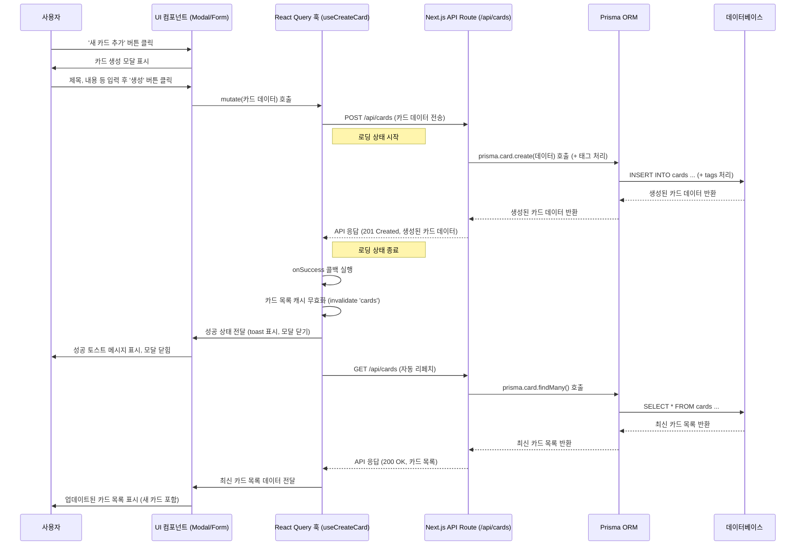

```mermaid
sequenceDiagram
    participant User as 사용자
    participant ReactComponent as UI 컴포넌트 (Modal/Form)
    participant ReactQueryHook as React Query 훅 (useCreateCard)
    participant API as Next.js API Route (/api/cards)
    participant Prisma as Prisma ORM
    participant DB as 데이터베이스

    User->>ReactComponent: '새 카드 추가' 버튼 클릭
    ReactComponent->>User: 카드 생성 모달 표시
    User->>ReactComponent: 제목, 내용 등 입력 후 '생성' 버튼 클릭
    ReactComponent->>ReactQueryHook: mutate(카드 데이터) 호출
    ReactQueryHook->>API: POST /api/cards (카드 데이터 전송)
    note right of ReactQueryHook: 로딩 상태 시작
    API->>Prisma: prisma.card.create(데이터) 호출 (+ 태그 처리)
    Prisma->>DB: INSERT INTO cards ... (+ tags 처리)
    DB-->>Prisma: 생성된 카드 데이터 반환
    Prisma-->>API: 생성된 카드 데이터 반환
    API-->>ReactQueryHook: API 응답 (201 Created, 생성된 카드 데이터)
    note right of ReactQueryHook: 로딩 상태 종료
    ReactQueryHook->>ReactQueryHook: onSuccess 콜백 실행
    ReactQueryHook->>ReactQueryHook: 카드 목록 캐시 무효화 (invalidate 'cards')
    ReactQueryHook->>ReactComponent: 성공 상태 전달 (toast 표시, 모달 닫기)
    ReactComponent->>User: 성공 토스트 메시지 표시, 모달 닫힘

    ReactQueryHook->>API: GET /api/cards (자동 리페치)
    API->>Prisma: prisma.card.findMany() 호출
    Prisma->>DB: SELECT * FROM cards ...
    DB-->>Prisma: 최신 카드 목록 반환
    Prisma-->>API: 최신 카드 목록 반환
    API-->>ReactQueryHook: API 응답 (200 OK, 카드 목록)
    ReactQueryHook->>ReactComponent: 최신 카드 목록 데이터 전달
    ReactComponent->>User: 업데이트된 카드 목록 표시 (새 카드 포함)
```