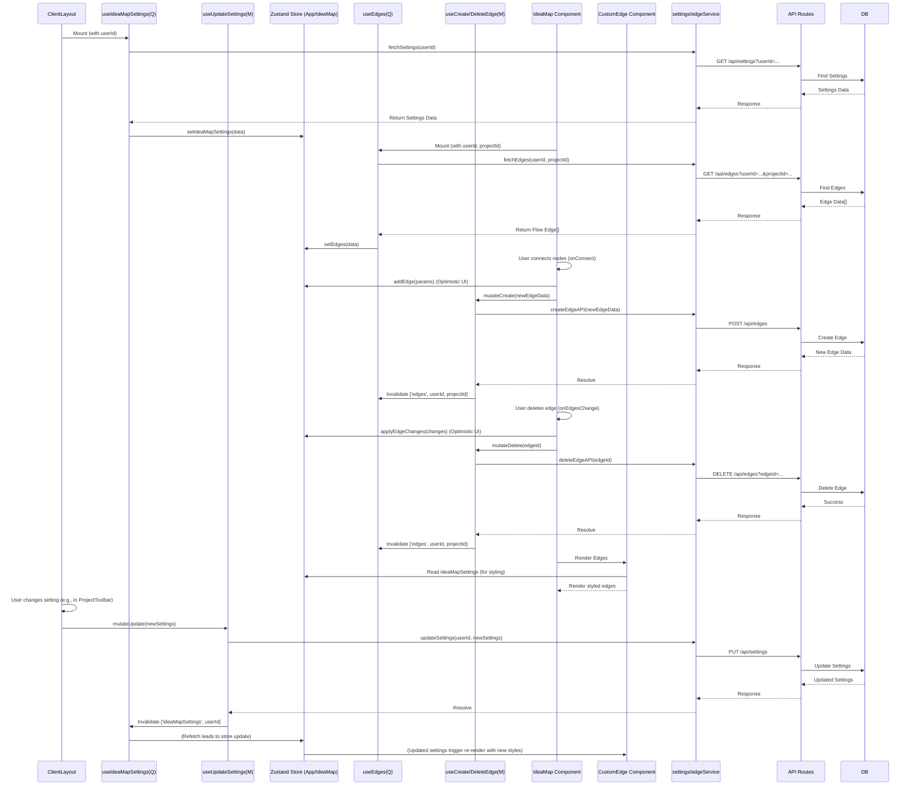

**리팩토링 방침:**

1.  **엣지(Edge) 정보 DB 연동:** 현재 `localStorage`에 저장되는 엣지 정보를 DB에 저장하고 불러오도록 변경합니다. 기존 `Edge` 모델과 관련 API/서비스/훅을 최대한 활용하고 수정은 최소화합니다.
2.  **설정(Settings) 로드 방식 변경:** 아이디어맵 관련 설정(엣지 스타일 등)을 앱 초기화 시 한 번 로드하여 Zustand 스토어에 저장하고, 엣지 렌더링 시 스토어의 설정 값을 참조하도록 변경합니다. 개별 엣지 렌더링 시 설정을 다시 가져오지 않습니다.

---

## Tasklist (Micro-Compose Style - Revised)

**규칙:** `Three-Layer-Standard` 준수. 

**선행 작업:**

*   **[Safety Net]** 현재 AS-IS 코드 상태에서 주요 사용자 시나리오(카드 생성/수정/삭제, 엣지 생성/삭제 - UI 상에서만, 설정 변경 등)를 커버하는 통합 테스트 또는 E2E 테스트를 확보합니다.

**Phase 1: Edge DB 저장 준비 및 localStorage 의존성 제거**

1.  **Task 1.1:** Prisma `Edge` 모델 및 관계 검증
    *   **파일:** `prisma/schema.prisma`
    *   **지침:**
        *   `Edge` 모델의 `source` 및 `target` 필드가 실제 DB에서 `Card` 테이블의 ID를 참조하는 외래 키로 설정되어 있는지 확인합니다. (만약 아니라면, 컬럼 타입을 `Uuid`로 변경하고 `@relation`을 추가해야 하지만, 최소 변경 원칙에 따라 현재는 타입만 확인합니다. 외래 키 제약 조건은 DB 레벨에서 이미 설정되어 있다고 가정).
        *   `@@map("source")`와 `@@map("target")`이 올바르게 설정되어 있는지 확인합니다.
        *   `Card` 모델에 `sourceEdges Edge[] @relation("SourceEdges")` 와 `targetEdges Edge[] @relation("TargetEdges")` 관계 필드가 정의되어 있는지 확인합니다.
        *   `Project`와 `User` 모델에 `edges Edge[]` 관계가 정의되어 있는지 확인합니다.
        *   `@@unique([projectId, sourceCardId, targetCardId], name: "project_source_target_edge")` 제약 조건이 존재하는지 확인합니다. (이전 스키마 제안 참고)
        *   **만약 위 사항 중 수정이 필요했다면:** 터미널에서 `npx prisma migrate dev --name verify_edge_relations` 실행 후 `npx prisma generate` 실행합니다. **수정이 없다면 이 단계는 건너뜁니다.**
    *   **예상 결과:** `Edge` 모델이 `Card`, `User`, `Project`와 올바르게 관계 맺어져 있고, Prisma Client 타입이 최신 상태임. DB 스키마 변경은 최소화됨.

2.  **Task 1.2:** 엣지 데이터 `localStorage` 로딩 제거
    *   **파일:** `src/store/useIdeaMapStore.ts` 또는 `src/components/ideamap/hooks/useIdeaMapData.ts` (엣지 초기 로딩 로직이 있는 곳)
    *   **지침:**
        *   `localStorage.getItem(IDEAMAP_EDGES_STORAGE_KEY)`를 사용하여 엣지 데이터를 불러오는 코드를 찾아 **제거**합니다.
        *   Zustand 스토어(`useIdeaMapStore`)의 초기 `edges` 상태를 빈 배열 `[]`로 설정합니다.
    *   **규칙:** `[store-pure-ui]` (스토어가 직접 localStorage 접근 금지)
    *   **예상 결과:** 앱 로드 시 `localStorage`에서 엣지를 불러오지 않으며, 초기 엣지 상태는 항상 비어있음.
    *   **테스트 시나리오:**
        1. 아이디어맵 페이지를 로드했을 때, 이전에 `localStorage`에 저장된 엣지가 있더라도 화면에 표시되지 않는지 확인합니다.
        2. 콘솔에 `localStorage` 관련 오류가 없는지 확인합니다.

3.  **Task 1.3 (신규):** 엣지 API 라우트 파일 생성 및 기본 GET 핸들러 구현
    *   **파일:** `src/app/api/edges/route.ts` (신규 생성)
    *   **지침:**
        *   파일을 새로 생성합니다.
        *   `GET` 요청 핸들러를 구현합니다.
        *   핸들러는 `userId`와 `projectId` 쿼리 파라미터를 받습니다.
        *   `auth()` 함수로 사용자 인증을 확인합니다. (인증 실패 시 401 응답)
        *   `prisma.edge.findMany`를 사용하여 해당 사용자와 프로젝트에 속한 엣지를 조회합니다.
        *   조회된 엣지 목록을 JSON 형태로 응답합니다. (오류 발생 시 500 응답)
        *   **함수 시그니처:** `export async function GET(request: NextRequest): Promise<NextResponse>`
        *   **코드 예시:** (이전 답변의 Task 4 코드 참고)
            ```typescript
            // src/app/api/edges/route.ts
            import { NextRequest, NextResponse } from 'next/server';
            import prisma from '@/lib/prisma';
            import { auth } from '@/lib/auth-server';

            export async function GET(request: NextRequest) {
              const session = await auth();
              if (!session?.user?.id) {
                return NextResponse.json({ error: 'Unauthorized' }, { status: 401 });
              }
              const userId = session.user.id;

              const { searchParams } = request.nextUrl;
              const projectId = searchParams.get('projectId');

              if (!projectId) {
                return NextResponse.json({ error: 'projectId is required' }, { status: 400 });
              }

              try {
                const edges = await prisma.edge.findMany({
                  where: { userId, projectId },
                  // 필요시 select 로 반환 필드 제한
                  // select: { id: true, sourceCardId: true, targetCardId: true, ... }
                });
                // console.log(`Fetched ${edges.length} edges for projectId: ${projectId}`); // 디버깅 로그
                return NextResponse.json(edges);
              } catch (error) {
                console.error(`Error fetching edges for projectId ${projectId}:`, error);
                return NextResponse.json({ error: 'Failed to fetch edges' }, { status: 500 });
              }
            }

            // POST, DELETE 핸들러는 다음 Task에서 구현
            ```
    *   **규칙:** `[layer-separation]`
    *   **예상 결과:** `/api/edges?userId=...&projectId=...` GET 요청 시 DB의 엣지 데이터를 JSON으로 반환하는 기본 API 생성됨.
    *   **테스트 시나리오:**
        1.  DB에 테스트용 엣지 데이터를 직접 몇 개 추가합니다.
        2.  Postman이나 브라우저 주소창 등을 이용하여 `/api/edges?projectId=<test_project_id>` GET 요청을 보냅니다 (인증 쿠키 필요 시 설정).
        3.  DB에 추가한 엣지 데이터가 JSON 형식으로 응답되는지 확인합니다.
        4.  `projectId` 없이 요청 시 400 오류 응답을 받는지 확인합니다.

4.  **Task 1.4 (신규):** 엣지 서비스 파일 생성 및 `fetchEdges` 함수 구현
    *   **파일:** `src/services/edgeService.ts` (신규 생성)
    *   **지침:**
        *   파일을 새로 생성합니다.
        *   `fetchEdges(userId: string, projectId: string): Promise<ApiEdge[]>` 함수를 구현합니다.
        *   이 함수는 내부적으로 Task 1.3에서 만든 `/api/edges` GET 엔드포인트를 `fetch` API로 호출합니다.
        *   성공 시 응답 JSON을 파싱하여 반환하고, 실패 시 에러를 throw합니다.
        *   `ApiEdge` 타입을 정의하여 API 응답 구조를 명시합니다.
        *   **함수 시그니처:**
            ```typescript
            import { ApiEdge } from './edgeService'; // 타입 정의 필요
            export async function fetchEdges(userId: string, projectId: string): Promise<ApiEdge[]>;
            ```
        *   **코드 예시:** (이전 답변의 Task 6 코드 참고 - fetchEdges 부분)
            ```typescript
             /**
             * @rule   three-layer-Standard
             * @layer  service
             * @tag    @service-msw fetchEdges
             * 설명    아이디어맵 엣지 정보 조회 서비스
             */
            import createLogger from '@/lib/logger';

            const logger = createLogger('edgeService');

            // ApiEdge 타입 정의 (DB 모델과 일치하게)
            export interface ApiEdge {
              id: string;
              sourceCardId: string; // 스키마에서 source @map으로 정의했다면 sourceCardId 사용
              targetCardId: string; // 스키마에서 target @map으로 정의했다면 targetCardId 사용
              userId: string | null; // 스키마에 맞게 Nullable 처리
              projectId: string;
              // 필요시 type, animated, style, data 필드 추가
              createdAt: string;
              updatedAt: string;
            }

            export async function fetchEdges(userId: string, projectId: string): Promise<ApiEdge[]> {
              // userId는 현재 fetchEdges 함수 시그니처에는 있지만 API 호출에는 사용되지 않음
              // API가 userId를 path param이나 body로 요구한다면 수정 필요
              if (!projectId) {
                logger.warn('fetchEdges: projectId가 제공되지 않았습니다.');
                return [];
              }
              try {
                const response = await fetch(`/api/edges?projectId=${encodeURIComponent(projectId)}`); // userId 쿼리 제거 (API가 session 기반 인증 사용)
                if (!response.ok) {
                  const errorData = await response.text();
                  throw new Error(`엣지 조회 실패: ${response.status} ${response.statusText} - ${errorData}`);
                }
                const data = await response.json();
                // console.log(`[edgeService] Fetched ${data.length} edges`); // 디버깅 로그
                return data;
              } catch (error) {
                logger.error('fetchEdges 오류:', error);
                throw error;
              }
            }

            // createEdgeAPI, deleteEdgeAPI는 다음 Task에서 구현
            ```
    *   **규칙:** `@service-msw fetchEdges`
    *   **예상 결과:** 엣지 조회 API 호출 로직이 `edgeService.ts`로 캡슐화됨.
    *   **테스트 시나리오:**
        1.  MSW 핸들러를 설정하여 `/api/edges` GET 요청을 모킹합니다.
        2.  `fetchEdges` 함수를 직접 호출하는 단위 테스트를 작성하여, 성공 시 모킹된 데이터를 반환하고 실패 시 에러를 던지는지 확인합니다.

5.  **Task 1.5 (신규):** `useEdges` TanStack Query 훅 생성
    *   **파일:** `src/hooks/useEdges.ts` (신규 생성)
    *   **지침:**
        *   파일을 새로 생성합니다.
        *   `useQuery` 훅을 사용하여 엣지 데이터를 조회하는 `useEdges(userId?: string, projectId?: string)` 훅을 구현합니다.
        *   `queryKey`는 `['edges', userId, projectId]`로 설정합니다.
        *   `queryFn`에서는 Task 1.4에서 만든 `edgeService.fetchEdges(userId!, projectId!)`를 호출합니다.
        *   `enabled: !!userId && !!projectId` 옵션을 사용하여 `userId`와 `projectId`가 모두 존재할 때만 쿼리가 실행되도록 합니다.
        *   `fetchEdges`가 반환하는 `ApiEdge[]` 데이터를 React Flow가 사용하는 `Edge[]` 타입으로 변환하는 로직을 `select` 옵션 또는 `queryFn` 내부에 추가합니다. (id, source, target 필드 매핑)
        *   **함수 시그니처:** `export function useEdges(userId?: string, projectId?: string): UseQueryResult<Edge[], Error>`
        *   **코드 예시:** (이전 답변의 Task 8 코드 참고 - useEdges 부분, 변환 함수 포함)
            ```typescript
            /**
             * @rule   three-layer-Standard
             * @layer  tanstack-query-hook
             * @tag    @tanstack-query-msw useEdges
             * 설명    아이디어맵 엣지 데이터 조회를 위한 TanStack Query 훅
             */
            import { useQuery, UseQueryResult } from '@tanstack/react-query';
            import { fetchEdges, ApiEdge } from '@/services/edgeService';
            import { Edge } from '@xyflow/react'; // React Flow 엣지 타입 import

            // API 엣지를 React Flow 엣지로 변환하는 함수
            const transformApiEdgeToFlowEdge = (apiEdge: ApiEdge): Edge => ({
                id: apiEdge.id,
                source: apiEdge.sourceCardId, // Prisma 스키마의 sourceCardId 필드 사용
                target: apiEdge.targetCardId, // Prisma 스키마의 targetCardId 필드 사용
                type: 'custom', // 기본 엣지 타입 또는 apiEdge에서 가져온 타입
                // animated: apiEdge.animated ?? false, // 필요시 추가
                // style: apiEdge.style ?? undefined, // 필요시 추가
                // data: apiEdge.data ?? undefined, // 필요시 추가
            });

            export function useEdges(userId?: string, projectId?: string): UseQueryResult<Edge[], Error> {
              return useQuery({
                queryKey: ['edges', userId, projectId],
                queryFn: async () => {
                    // console.log(`[useEdges] Fetching edges for userId: ${userId}, projectId: ${projectId}`); // 디버깅 로그
                    const apiEdges = await fetchEdges(userId!, projectId!);
                    const flowEdges = apiEdges.map(transformApiEdgeToFlowEdge);
                    // console.log(`[useEdges] Transformed ${flowEdges.length} edges`); // 디버깅 로그
                    return flowEdges;
                },
                enabled: !!userId && !!projectId,
                staleTime: 1 * 60 * 1000, // 1분 stale time (조정 가능)
                gcTime: 5 * 60 * 1000, // 5분 gc time (조정 가능)
              });
            }

            // useCreateEdge, useDeleteEdge는 다음 Task에서 구현
            ```
    *   **규칙:** `@tanstack-query-msw useEdges`, `[query-key]`
    *   **예상 결과:** 엣지 데이터를 조회하고 React Flow 형식으로 변환하여 제공하는 TanStack Query 훅 생성 완료.
    *   **테스트 시나리오:**
        1.  `QueryClientProvider`와 MSW를 사용하여 `useEdges` 훅을 테스트하는 환경을 설정합니다.
        2.  `renderHook`을 사용하여 훅을 실행하고, `isLoading`, `isSuccess`, `data`, `error` 상태가 예상대로 변경되는지 확인합니다.
        3.  반환된 `data`가 React Flow의 `Edge[]` 형식(`id`, `source`, `target` 포함)인지 확인합니다.


**Phase 2: Edge DB 저장/로드 로직 구현**

1.  **Task 2.1:** `useEdges` 쿼리 훅을 사용하여 엣지 데이터 로드 및 Zustand 상태 업데이트
    *   **파일:** `src/components/ideamap/hooks/useIdeaMapData.ts` (또는 데이터 로딩을 담당하는 다른 훅/컴포넌트)
    *   **지침:**
        *   현재 활성화된 `userId`와 `projectId`를 가져옵니다 (e.g., `useAuthStore`, `useAppStore` 사용).
        *   `useEdges(userId, projectId)` 쿼리 훅을 호출합니다.
        *   `useEffect`를 사용하여 `useEdges` 훅의 `data` (React Flow `Edge[]` 형식)가 성공적으로 로드되면(`isSuccess` 및 `data` 존재 확인), `useIdeaMapStore`의 `setEdges(data)` 액션을 호출하여 Zustand 상태를 업데이트합니다.
        *   **주의:** `useEdges` 훅이 반환하는 데이터가 React Flow의 `Edge` 타입(`source`, `target` 필드 포함)인지 확인하고, 필요시 `transformApiEdgeToFlowEdge` 같은 변환 함수를 사용합니다 (이전 답변의 훅 코드 참고).
    *   **규칙:** `[layer-separation]` (데이터 로딩은 TanStack Query, 상태 업데이트는 Zustand)
    *   **예상 결과:** 아이디어맵 로드 시 DB에서 엣지 데이터를 가져와 Zustand 스토어에 저장하고 화면에 표시됨.
    *   **테스트 시나리오:**
        1. DB에 미리 몇 개의 엣지 데이터를 넣어둡니다.
        2. 아이디어맵 페이지 로드 시, DB에 저장된 엣지들이 정상적으로 화면에 렌더링되는지 확인합니다.
        3. React Query DevTools에서 `['edges', userId, projectId]` 쿼리가 성공적으로 실행되었는지 확인합니다.

2.  **Task 2.2:** `onConnect` 핸들러에서 `useCreateEdge` 뮤테이션 호출
    *   **파일:** `src/components/ideamap/components/IdeaMap.tsx` 또는 `src/components/ideamap/hooks/useIdeaMapHandlers.ts` ( `onConnect` 로직이 있는 곳)
    *   **지침:**
        *   `useCreateEdge` 뮤테이션 훅을 호출합니다.
        *   기존 `onConnect` 콜백 함수 내에서, `addEdge(params)` (Zustand 상태 업데이트) 호출 *후에* `createEdgeMutation.mutate({ sourceCardId: params.source, targetCardId: params.target, projectId })` 를 호출합니다.
        *   `mutate` 함수의 `onError` 콜백에서 생성 실패 시 사용자에게 알림(toast)을 표시하고, 필요하면 Zustand 상태를 롤백하는 로직을 추가합니다 (예: `setEdges((prevEdges) => prevEdges.filter(e => e.source !== params.source || e.target !== params.target))` - 단, ID 기반 롤백이 더 안전).
        *   `useCreateEdge` 훅 내부의 `onSuccess`에서 쿼리 무효화가 이미 설정되어 있는지 확인합니다.
    *   **규칙:** `[tanstack-mutation-msw]`, `[cache-inval]`
    *   **예상 결과:** 사용자가 노드를 연결하면 UI에 즉시 엣지가 표시되고, 백그라운드에서 DB 저장이 시도됨. 성공 시 데이터 동기화, 실패 시 알림 표시.
    *   **테스트 시나리오:**
        1. 두 노드를 연결하여 엣지를 생성합니다.
        2. UI에 엣지가 즉시 나타나는지 확인합니다.
        3. 페이지 새로고침 후에도 생성된 엣지가 DB에서 로드되어 유지되는지 확인합니다.
        4. (선택) MSW를 사용하여 `/api/edges` POST 요청을 실패하도록 모킹하고, 엣지 생성 시도 시 에러 토스트가 뜨고 UI에서 엣지가 사라지는지(롤백) 확인합니다.

3.  **Task 2.3:** 엣지 삭제 시 `useDeleteEdge` 뮤테이션 호출
    *   **파일:** `src/components/ideamap/components/IdeaMap.tsx` 또는 `src/components/ideamap/hooks/useIdeaMapHandlers.ts` ( `onEdgesChange` 또는 커스텀 삭제 로직이 있는 곳)
    *   **지침:**
        *   `useDeleteEdge` 뮤테이션 훅을 호출합니다.
        *   엣지 삭제 이벤트(React Flow의 `onEdgesChange`에서 `type: 'remove'` 변경 감지 또는 커스텀 삭제 버튼 클릭) 발생 시, `applyEdgeChanges(changes)` (Zustand 상태 업데이트) 호출 *후에* 해당 `edgeId`를 사용하여 `deleteEdgeMutation.mutate(edgeId)` 를 호출합니다.
        *   `mutate` 함수의 `onError` 콜백에서 삭제 실패 시 사용자에게 알림(toast)을 표시합니다. (롤백은 쿼리 무효화/리페치에 맡기거나, 필요시 상태 직접 복구).
        *   `useDeleteEdge` 훅 내부의 `onSuccess`에서 쿼리 무효화가 이미 설정되어 있는지 확인합니다.
    *   **규칙:** `[tanstack-mutation-msw]`, `[cache-inval]`
    *   **예상 결과:** 사용자가 엣지를 삭제하면 UI에서 즉시 사라지고, 백그라운드에서 DB 삭제가 시도됨. 성공 시 데이터 동기화, 실패 시 알림 표시.
    *   **테스트 시나리오:**
        1. 기존 엣지를 선택하고 삭제합니다 (React Flow 기본 동작 또는 커스텀 버튼).
        2. UI에서 엣지가 즉시 사라지는지 확인합니다.
        3. 페이지 새로고침 후 해당 엣지가 DB에서 삭제되어 더 이상 로드되지 않는지 확인합니다.
        4. (선택) MSW를 사용하여 `/api/edges` DELETE 요청을 실패하도록 모킹하고, 엣지 삭제 시도 시 에러 토스트가 뜨는지 확인합니다.

4.  **Task 2.4:** 엣지 데이터 `localStorage` 저장 제거
    *   **파일:** `src/store/useIdeaMapStore.ts` 또는 `src/components/ideamap/hooks/useIdeaMapLayout.ts` (엣지 저장 로직이 있는 곳)
    *   **지침:**
        *   `localStorage.setItem(IDEAMAP_EDGES_STORAGE_KEY, ...)` 코드를 찾아 **완전히 제거**합니다.
    *   **예상 결과:** 엣지 데이터는 더 이상 `localStorage`에 저장되지 않음.

5.  **Task 2.5 (신규):** 엣지 API 라우트 핸들러 구현 (POST, DELETE)
    *   **파일:** `src/app/api/edges/route.ts` (수정)
    *   **지침:** Task 1.3에서 만든 파일에 `POST` 및 `DELETE` 핸들러를 추가합니다.
        *   `POST`: 요청 본문에서 `sourceCardId`, `targetCardId`, `projectId`를 받아 유효성 검사 후 `prisma.edge.create`를 사용하여 새 엣지 생성. 생성된 엣지 정보 반환 (201).
        *   `DELETE`: 쿼리 파라미터에서 `edgeId`를 받아 `prisma.edge.delete`를 사용하여 해당 엣지 삭제 (해당 사용자의 엣지만 삭제하도록 `userId` 조건 추가). 성공 메시지 반환 (200 또는 204).
        *   `auth()` 및 Zod 스키마 사용.
    *   **코드 예시:** (이전 답변 Task 4 코드의 POST, DELETE 부분 참고)
    *   **예상 결과:** 엣지 생성 및 삭제 API 엔드포인트 구현 완료.
    *   **테스트 시나리오:**
        1.  Postman 등을 사용하여 `/api/edges` POST 요청으로 엣지 생성을 시도하고, DB에 반영되는지와 201 응답을 받는지 확인합니다. 유효하지 않은 데이터로 요청 시 400 오류를 받는지 확인합니다.
        2.  Postman 등을 사용하여 `/api/edges?edgeId=<test_edge_id>` DELETE 요청으로 엣지 삭제를 시도하고, DB에서 삭제되는지와 200/204 응답을 받는지 확인합니다. 존재하지 않는 ID로 요청 시 404 오류를 받는지 확인합니다.

6.  **Task 2.6 (신규, 2.2-2:** 엣지 서비스 함수 구현 (`createEdgeAPI`, `deleteEdgeAPI`)
    *   **파일:** `src/services/edgeService.ts` (수정)
    *   **지침:** Task 1.4에서 만든 파일에 `createEdgeAPI`와 `deleteEdgeAPI` 함수를 추가합니다.
        *   `createEdgeAPI`: `/api/edges` POST 엔드포인트 호출.
        *   `deleteEdgeAPI`: `/api/edges` DELETE 엔드포인트 호출.
        *   `fetch` API 및 에러 처리 포함.
    *   **코드 예시:** (이전 답변 Task 6 코드의 create/delete 부분 참고, 함수 이름에 API 접미사 추가)
    *   **규칙:** `@service-msw createEdge`, `@service-msw deleteEdge`
    *   **예상 결과:** 엣지 생성/삭제 API 호출 로직 캡슐화 완료.
    *   **테스트 시나리오:**
        1.  MSW를 사용하여 `/api/edges` POST 및 DELETE 요청을 모킹합니다.
        2.  `createEdgeAPI`, `deleteEdgeAPI` 함수를 직접 호출하는 단위 테스트를 작성하여 성공/실패 시나리오를 검증합니다.

7.  **Task 2.7 (신규):** 엣지 뮤테이션 훅 생성 (`useCreateEdge`, `useDeleteEdge`)
    *   **파일:** `src/hooks/useEdges.ts` (수정)
    *   **지침:** Task 1.5에서 만든 파일에 `useCreateEdge`와 `useDeleteEdge` 뮤테이션 훅을 추가합니다.
        *   `useCreateEdge`: `edgeService.createEdgeAPI` 호출. `onSuccess` 시 `['edges', userId, projectId]` 쿼리 무효화.
        *   `useDeleteEdge`: `edgeService.deleteEdgeAPI` 호출. `onSuccess` 시 `['edges', userId, projectId]` 쿼리 무효화 또는 캐시 직접 수정.
    *   **코드 예시:** (이전 답변 Task 8 코드의 useCreateEdge, useDeleteEdge 부분 참고)
    *   **규칙:** `@tanstack-mutation-msw useCreateEdge`, `@tanstack-mutation-msw useDeleteEdge`, `[cache-inval]`
    *   **예상 결과:** 엣지 생성/삭제를 위한 TanStack Query 뮤테이션 훅 생성 완료.
    *   **테스트 시나리오:**
        1.  `QueryClientProvider`와 MSW를 사용하여 `useCreateEdge`, `useDeleteEdge` 훅을 테스트하는 환경을 설정합니다.
        2.  `renderHook`으로 훅 실행 후 `mutate` 함수를 호출하고, `isSuccess`, `isPending`, `error` 상태 및 `onSuccess` 콜백(쿼리 무효화)이 올바르게 동작하는지 검증합니다.


**Phase 3: 설정(Settings) 로드 방식 변경**

1.  **Task 3.1:** 앱 초기화 시 설정 데이터 로드 및 Zustand 저장
    *   **파일:** `src/components/layout/ClientLayout.tsx` 또는 앱의 최상위 클라이언트 컴포넌트
    *   **지침:**
        *   `useAuthStore`를 사용하여 현재 로그인된 `userId`를 가져옵니다.
        *   `userId`가 존재하면, *기존에 구현된* `useIdeaMapSettings(userId)` 쿼리 훅을 호출합니다. (이 훅은 내부적으로 `settingsService.fetchSettings`를 사용해야 함).
        *   `useEffect`를 사용하여 `useIdeaMapSettings` 쿼리가 성공(`isSuccess` 및 `data` 확인)하면, 가져온 설정 데이터(`data`)를 사용하여 `useAppStore` 또는 `useIdeaMapStore`의 설정 상태 업데이트 액션(예: `setIdeaMapSettings(data)`)을 호출합니다. 이 `useEffect`는 `userId` 변경 시 또는 쿼리 성공 시 실행되도록 설정합니다.
    *   **규칙:** `[layer-separation]`, `[tanstack-query-msw]`, `[store-pure-ui]`
    *   **예상 결과:** 앱 로드 시 사용자별 아이디어맵 설정이 DB에서 한 번 로드되어 Zustand 스토어에 저장됨.
    *   **테스트 시나리오:**
        1. 로그인 후 앱을 로드합니다.
        2. React Query DevTools에서 `['ideaMapSettings', userId]` 쿼리가 성공적으로 실행되는지 확인합니다.
        3. Zustand DevTools (Redux DevTools Extension)에서 관련 스토어의 `ideaMapSettings` 상태가 DB에서 로드된 값으로 업데이트되었는지 확인합니다.

2.  **Task 3.2:** 엣지 스타일링 로직에서 Zustand 설정 참조
    *   **파일:** `src/components/ideamap/nodes/CustomEdge.tsx` 또는 엣지 스타일을 적용하는 다른 컴포넌트/훅
    *   **지침:**
        *   엣지의 `style`, `markerEnd`, `animated` 등의 속성을 결정하는 로직을 찾습니다.
        *   이 로직이 `useAppStore` 또는 `useIdeaMapStore`에서 **Task 3.1**에서 저장한 `ideaMapSettings` 상태를 직접 읽어서 사용하도록 수정합니다.
        *   엣지 렌더링 과정에서 설정을 다시 fetch하거나 props로 깊게 전달받는 부분을 제거합니다.
    *   **규칙:** `[layer-separation]` (컴포넌트는 Zustand 상태 직접 참조)
    *   **예상 결과:** 모든 엣지가 Zustand 스토어에 저장된 단일 설정 소스를 참조하여 일관된 스타일로 렌더링됨.
    *   **테스트 시나리오:**
        1. 아이디어맵에 여러 엣지가 렌더링될 때, 모든 엣지가 동일한 스타일(색상, 두께, 마커 등)을 가지는지 확인합니다 (Zustand에 저장된 설정 기준).

3.  **Task 3.3:** 설정 업데이트 플로우 확인
    *   **파일:** `src/components/layout/ProjectToolbar.tsx` (설정 변경 UI가 있는 곳), `src/hooks/useIdeaMapSettings.ts`
    *   **지침:**
        *   설정 변경 UI (예: `ProjectToolbar`의 드롭다운 메뉴)에서 `useUpdateIdeaMapSettingsMutation` 뮤테이션 훅을 사용하는지 확인합니다.
        *   `useUpdateIdeaMapSettingsMutation` 훅의 `onSuccess` 콜백에서 `queryClient.invalidateQueries({ queryKey: ['ideaMapSettings', userId] })`가 호출되는지 확인합니다.
    *   **규칙:** `[tanstack-mutation-msw]`, `[cache-inval]`
    *   **예상 결과:** 설정 변경 시 DB 업데이트 후 관련 쿼리가 무효화되어, **Task 3.1**의 `useIdeaMapSettings` 훅이 리페치되고, Zustand 스토어가 업데이트되어, 결과적으로 **Task 3.2**의 엣지 스타일이 자동으로 변경됨.
    *   **테스트 시나리오:**
        1. `ProjectToolbar` 등에서 엣지 색상이나 두께 설정을 변경합니다.
        2. API 요청 (PUT/POST `/api/settings`)이 성공하는지 확인합니다 (네트워크 탭 또는 MSW 로그).
        3. React Query DevTools에서 `['ideaMapSettings', userId]` 쿼리가 무효화되고 리페치되는지 확인합니다.
        4. 잠시 후 아이디어맵의 모든 엣지 스타일이 변경된 설정에 맞게 업데이트되는지 확인합니다.
        5. 페이지 새로고침 시에도 변경된 설정이 유지되는지 확인합니다.

**최종 검증:**

*   **Task 4.1:** [Safety Net] 기존 통합/E2E 테스트 재실행
    *   **파일:** 해당 테스트 파일
    *   **지침:** 모든 리팩토링 완료 후, 선행 작업에서 확보한 테스트를 실행하여 기능 회귀가 없는지 최종 확인합니다.
    *   **예상 결과:** 모든 테스트 통과. 핵심 기능 정상 동작 확인.

---

**Mermaid Diagram (Revised Flow):**



이 수정된 Tasklist는 엣지 DB 연동과 설정 로드 방식 변경에 초점을 맞춰 단계적으로 진행할 수 있도록 구성되었습니다. 각 단계를 완료할 때마다 테스트를 통해 안정성을 확인하는 것이 중요합니다.