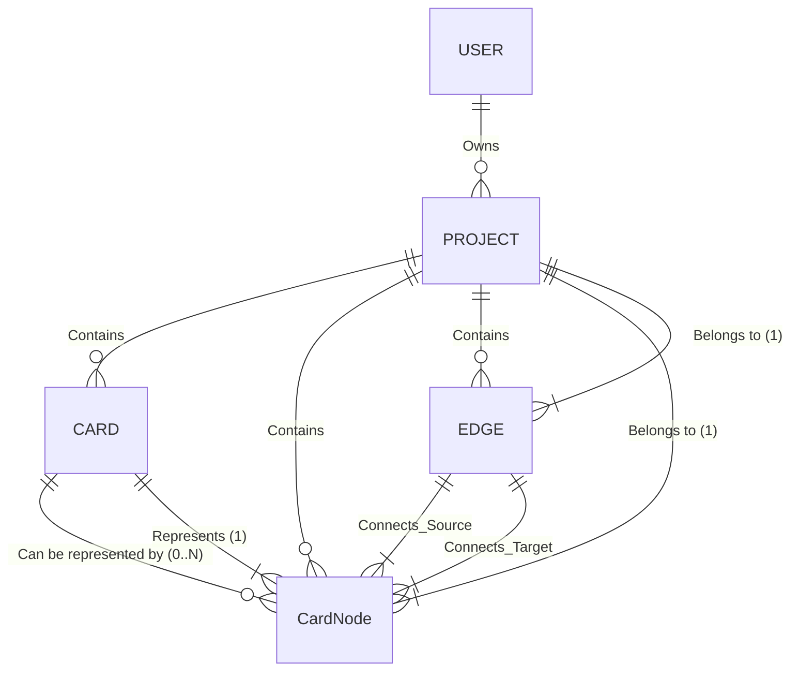

# 데이터 모델 및 상호작용 원칙 (Project, Card, CardNode, Edge)

```최종 수정일: 2023-05-01```

## 목표
*   backyard의 핵심 데이터 엔티티(Project, Card, CardNode, Edge) 관계 정의
*   이 데이터를 다루는 원칙을 수립하여 개발 효율성을 높이고 데이터 무결성을 보장한다. 
*   이 문서는 "Source of Truth"를 명시한다. 

## 핵심 아키텍처:

*   **핵심 데이터 (Source of Truth) - Card:** 카드는 생각(혹은 글줄)의 뭉치. 사용자가 짧게 메모하거나 길게 생각하며 적은 글의 최소 단위. 지식 관리와 창작이라는 목표를 달성하기 위해, Backyard 앱은 Card를 1순위로 보존하고, 모든 데이터는 Card 중심으로 처리한다. 
*   **Card-Node 분리:** 실제 데이터(`Card`)와 아이디어맵의 시각적 표현 및 레이아웃(`CardNode`)은 명확하게 분리한다. (문서에서 노드=CardNode를 의미함)
*   **DB 중심:** 모든 데이터(Card 내용, Node 위치, Edge 연결, Project 정보 등)는 데이터베이스(Supabase/PostgreSQL)에 저장하고 관리한다. 로컬 스토리지는 임시 캐시 외 영구 데이터 저장 용도로 사용하지 않는다.
*   **프로젝트 스코프:** 모든 Card, CardNode, Edge는 특정 `Project`에 종속된다.
*   **사용자와 프로젝트:** 사용자는 복수의 프로젝트를 소유할 수 있다. (이후 공동 소유도 구현 예정)

**참고:** (TODO)는 개발 예정 기능

## 1. 기본 UI 용어
*   **사이드바 (Sidebar)** 
    *   앱 오른쪽 (혹은 사용자가 지정한 위치)에 표시하는 패널. 
    *   카드덱의 역할. 카드는 무조건 사이드바에 표시함 
*   **아이디어맵**
    *   reactflow 구현체 
    *   카드를 아이디어맵에 드래그하거나 기타 UI로 **추가**하면 노드로 표시한다. 
    *   노드와 엣지로 트리를 표현하고, 이 트리 관계로 AI 기반 콘텐츠를 생성한다 (TODO)
*   **프로젝트 툴바**
    *   프로젝트 관련 정보 표시, 설정 등을 하는 도구 막대 
*   **메인 툴바**
    *   앱 하단 중앙에 표시. 객체 삽입 및 중요 기능 배치.

## 2. 엔티티 정의

*   **`Project`:**
    *   **역할:** 작업의 최상위 컨테이너. Cards, CardNodes, Edges, Members, 설정 등 관련된 모든 데이터를 그룹화한다.
    *   **저장소:** DB (`projects` 테이블).
    *   **주요 속성:** `id`, `name`, `ownerId`, `settings`, `createdAt`, `updatedAt`.
    *   **관리 주체:** 전역 상태(TanStack Query, Zustand `activeProjectId`), 관련 API (`/api/projects`).
    *   **특징:** 
        *   사용자가 소유하며, 향후 다른 사용자와 공유될 수 있다 (멤버 관리)
        *   아직 기능 개발 중이므로 activeProject는 projects 테이블의 1st row로 지정. (TODO)
    *   **시나리오 (TODO):** 
        *   사용자가 New Project, 혹은 Load Project를 선택한다 
        *   New Project → Project 기본 정보 입력 → 새 ID DB 저장 → setActiveProjectId → UI 초기화 → 앱 표시
        *   Load Project → user가 소유한 project list → 선택 → setActiveProjectId → 아이디어 맵, 사이드 바 등 UI에 정보 주입 → UI 초기화 끝날때 까지 loading → 앱 표시

*   **`Card`:**
    *   **역할:** 앱의 기본 정보 단위 (메모, 아이디어, 글). 데이터의 **Source of Truth**.
    *   **저장소:** DB (`cards` 테이블).
    *   **주요 속성:** `id`, `title`, `content`, `projectId`, `userId`, `createdAt`, `updatedAt`.
    *   **관리 주체:** 전역 상태(TanStack Query 캐시), 사이드바 UI, 관련 API (`/api/cards`).
    *   **특징:** 
        *   특정 `Project`에 속한다. 
        *   아이디어맵에 추가하는 노드의 원본. 아이디어맵에서 노드의 추가/삭제와 카드는 관계가 없다.
        *   카드는 사이드바에 반드시 표시하고, 사이드바에서 삭제하면 DB에서도 삭제한다. 

*   **`CardNode`:**
    *   **역할:** 
        *   특정 `Project`의 아이디어맵 위에서 특정 `Card`를 시각적으로 **표현**하고, 맵에서의 **위치 및 개별 스타일** 정보를 저장한다.
        *   CardNode는 아이디어 맵 UI 구현체인 reactflow에서 node를 랜더링할 때 필요한 모든 데이터와 Card와의 관계 데이터를 가지고 있어야 한다. 
    *   **저장소:** DB (`card_nodes` 테이블).
    *   **주요 속성:** `id` (PK), `cardId` (FK), `projectId` (FK), `positionX`, `positionY`, (선택적) `styleJson`, `dataJson`, `createdAt`, `updatedAt`.
    *   **관리 주체:** 아이디어맵 UI, 관련 상태 관리(TanStack Query 캐시), 관련 API (`/api/cardnodes`).
    *   **특징:** 반드시 하나의 `Card`와 하나의 `Project`에 연결된다.

*   **`Edge`:**
    *   **역할:** 
        *   특정 `Project`의 아이디어맵 위에서 두 개의 `CardNode` 사이의 **연결(관계)**을 나타낸다.
        *   Edge는 아이디어 맵의 UI 구현체인 reactflow에서 노드 사이의 엣지를 랜더링할 때 필요한 데이터를 가진다. 
    *   **저장소:** DB (`edges` 테이블).
    *   **주요 속성:** `id`, `source` (CardNode ID), `target` (CardNode ID), `projectId`, (선택적) `sourceHandle`, `targetHandle`, `type`, `animated`, `style`, `data`, `createdAt`, `updatedAt`.
    *   **관리 주체:** 아이디어맵 UI, 관련 상태 관리(TanStack Query 캐시), 관련 API (`/api/edges`).
    *   **특징:** 
        *   반드시 두 개의 `CardNode`와 하나의 `Project`에 연결된다. (주의: DB 스키마의 `source`, `target`은 `CardNode`의 ID를 참조해야 함 - 현재 스키마 확인 필요)
        *   아이디어 맵에서 엣지의 source 혹은 target에 해당하는 노드를 삭제하면 엣지도 삭제한다. 

**2. 핵심 관계 및 규칙 (Mermaid Diagram):**



*   **`Card`와 `CardNode`는 1:0..N 관계:** 카드는 맵에 없을 수도, 여러 노드로 표현될 수도 있다.
*   **`CardNode`는 반드시 `Card`와 `Project`에 속한다.**
*   **`Edge`는 반드시 두 개의 `CardNode`와 하나의 `Project`에 속한다.**
*   **DB Cascade:** `Project` 삭제 시 관련된 모든 `Card`, `CardNode`, `Edge` 등이 연쇄적으로 삭제된다. `Card` 삭제 시 관련된 `CardNode`가 연쇄적으로 삭제된다. (`onDelete: Cascade` 설정 확인 필수)

**3. 데이터 CRUD 원칙 및 처리 흐름:**

| 액션                       | 주체          | 트리거                               | 처리 내용                                                                                                                                                              | DB 변경                                                                      | React Flow 상태 업데이트                     |
| :------------------------- | :------------ | :----------------------------------- | :--------------------------------------------------------------------------------------------------------------------------------------------------------------------- | :--------------------------------------------------------------------------- | :------------------------------------------- |
| **프로젝트 생성**        | 사용자        | 새 프로젝트 생성 버튼 등             | `useCreateProject` 호출                                                                                                                                              | `projects` 테이블에 INSERT                                                  | (`projects` 쿼리 무효화)                   |
| **카드 생성**            | 사이드바      | 새 카드 추가 버튼                    | `useCreateCard` 호출                                                                                                                                                   | `cards` 테이블에 INSERT                                                  | (`cards` 쿼리 무효화)                      |
| **노드 생성 (From Card)** | 아이디어맵    | 1. 카드 생성 (Toolbar)               | 1. `useCreateCard` 호출<br/> 2. 성공 시 `useCreateCardNode` 호출 (반환된 `cardId`, `position`, `projectId` 사용)                                                    | `cards` INSERT<br/>`card_nodes` INSERT                                       | (`cardNodes` 쿼리 무효화 또는 낙관적 업데이트) |
|                            | 아이디어맵    | 2. 기존 카드 Drag & Drop             | 드롭된 `cardId`, `position`, `projectId`로 `useCreateCardNode` 호출                                                                                                    | `card_nodes` INSERT                                                          | (`cardNodes` 쿼리 무효화 또는 낙관적 업데이트) |
| **엣지 생성**            | 아이디어맵    | 노드 핸들 연결                       | `onConnect` -> `useCreateEdge` 호출 (`sourceNodeId`, `targetNodeId`, `projectId` 등 사용)                                                                            | `edges` 테이블에 INSERT                                                  | (`edges` 쿼리 무효화 또는 낙관적 업데이트) |
| **노드 삭제 (맵에서만)**   | 아이디어맵    | 노드 선택 후 Delete 키 등            | `onNodesChange` (`remove`) -> `useDeleteCardNode` 호출 (`cardNodeId`, `projectId` 사용)                                                                                | `card_nodes` 테이블 DELETE                                                 | (`cardNodes` 쿼리 무효화 또는 낙관적 업데이트) |
| **카드 삭제 (데이터)**     | 사이드바      | 카드 삭제 버튼                       | `useDeleteCard` 호출                                                                                                                                                   | `cards` DELETE<br/>(Cascade로 `card_nodes` 자동 DELETE)                      | (`cards`, `cardNodes` 쿼리 무효화)         |
| **카드 내용 수정**         | 사이드바/맵   | 카드 편집 완료                       | `useUpdateCard` 호출                                                                                                                                                   | `cards` UPDATE                                                               | (`cards` 쿼리 무효화 또는 캐시 업데이트)     |
| **노드 위치/스타일 수정**  | 아이디어맵    | 노드 드래그 완료 / 스타일 변경       | `onNodeDragStop` 등 -> `useUpdateCardNodePosition/Style` 호출 (`cardNodeId`, 새 정보, `projectId` 사용)                                                                 | `card_nodes` UPDATE                                                          | (`cardNodes` 쿼리 무효화 또는 낙관적 업데이트) |
| **엣지 수정 (스타일 등)**  | 아이디어맵    | (구현 시) 엣지 정보 변경           | `useUpdateEdge` 호출                                                                                                                                                   | `edges` UPDATE                                                               | (`edges` 쿼리 무효화 또는 낙관적 업데이트) |
| **엣지 삭제**            | 아이디어맵    | 엣지 선택 후 Delete 키 등            | `onEdgesChange` (`remove`) -> `useDeleteEdge` 호출 (`edgeId`, `projectId` 사용)                                                                                        | `edges` DELETE                                                               | (`edges` 쿼리 무효화 또는 낙관적 업데이트) |

**4. 기술 구현 가이드라인:**

*   **DB 스키마:** Prisma 스키마에 `Project`, `Card`, `CardNode`, `Edge` 모델과 관계를 정확히 정의하고, `onDelete: Cascade`를 적극 활용하여 데이터 무결성을 유지한다. `@map`을 사용하여 DB 네이밍 컨벤션(snake_case)을 따른다.
*   **API:** 각 엔티티별 CRUD API 엔드포인트(`/api/projects`, `/api/cards`, `/api/cardnodes`, `/api/edges`)를 구현하고, `projectId` 및 `userId` 기반의 인증/인가 로직(RLS 활용)을 반드시 포함한다.
*   **TanStack Query:**
    *   각 엔티티 조회를 위한 쿼리 훅(`useProjects`, `useCards`, `useCardNodes`, `useEdges`)을 구현한다. 쿼리 키는 `['entityName', scopeIdentifier]` 형태로 일관성 있게 관리한다 (예: `['cardNodes', projectId]`).
    *   각 CRUD 작업을 위한 뮤테이션 훅(`useCreateCard`, `useCreateCardNode`, `useDeleteCardNode` 등)을 구현한다.
    *   **낙관적 업데이트**를 적극 사용하여 UI 반응성을 높인다.
    *   뮤테이션 성공/실패/완료 시 관련 쿼리를 적절히 **무효화(invalidate)**하거나 직접 **캐시를 업데이트(setQueryData)**하여 서버 상태와 UI를 동기화한다.
*   **상태 관리 (Zustand):**
    *   **서버 상태(Project 목록, Card 목록, CardNode 목록, Edge 목록)는 TanStack Query 캐시가 관리한다.** Zustand는 이 데이터를 직접 저장하지 않는다.
    *   Zustand는 **순수 UI 상태** (예: 로딩 상태, 현재 선택된 카드/노드/엣지 ID, 활성 프로젝트 ID(`activeProjectId`), 아이디어맵 UI 설정(`ideaMapSettings`), 사이드바 상태 등) 관리에 집중한다.
*   **아이디어맵 UI:**
    *   TanStack Query 훅 (`useCardNodes`, `useCards`, `useEdges`)을 통해 데이터를 가져온다.
    *   가져온 `dbCardNodes`와 `cardsData`를 조합하여 최종 `nodes` 배열을 생성하고, `edges` 데이터를 `<ReactFlow>` 컴포넌트에 전달한다.
    *   사용자 인터랙션(연결, 드래그, 삭제 등) 시 해당 뮤테이션 훅을 호출한다.

**5. 향후 고려사항:**

*   개별 `CardNode` 및 `Edge` 스타일 수정 및 저장 기능 구현.
*   프로젝트 공유 및 멤버별 권한 관리 기능 구현 (RLS 정책 확장 필요).