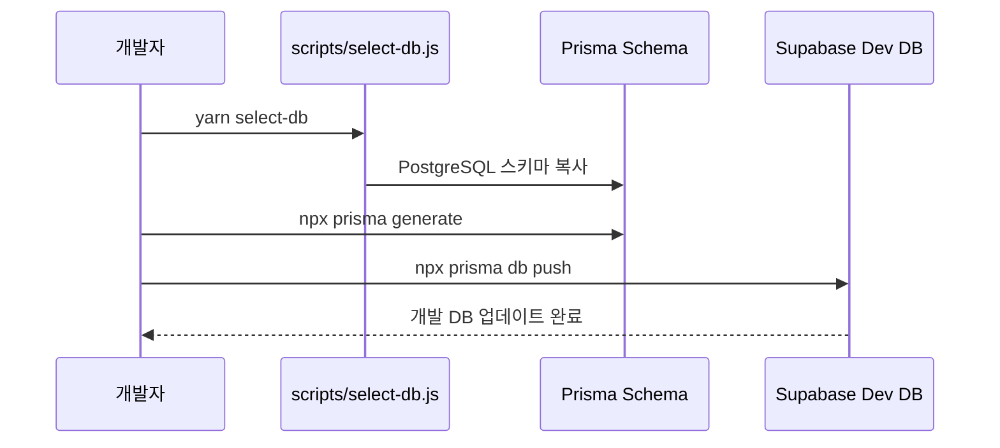
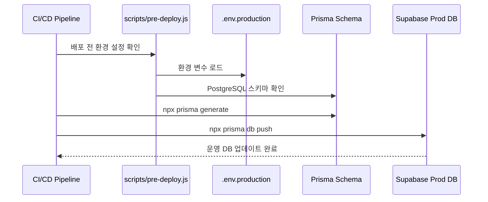
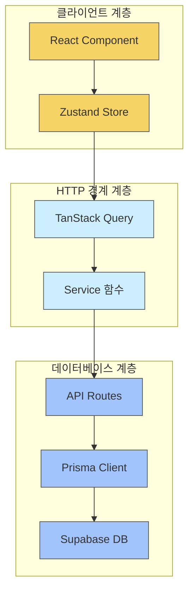

/**
 * 파일명: docs/architecture/dev-prod-setup.md
 * 목적: Supabase 개발/운영 환경 설정 문서
 * 역할: Supabase DB 개발 및 운영 환경 설정 방법과 아키텍처 설명
 * 작성일: 2024-05-25
 * @rule   three-layer-Standard
 */

# Supabase 개발/운영 환경 설정

이 문서는 Backyard 애플리케이션의 Supabase 개발 및 운영 환경 설정에 대해 설명합니다.

## 환경 구성

Backyard 애플리케이션은 다음 두 가지 Supabase 환경을 사용합니다:

1. **개발 환경(Dev)**: 개발 및 테스트용
2. **운영 환경(Production)**: 실제 서비스용

## 환경 변수 설정

각 환경은 다음 환경 변수 파일을 통해 관리됩니다:

- `.env.development`: 개발 환경 변수
- `.env.production`: 운영 환경 변수

각 환경 변수 파일에는 다음 설정이 포함되어야 합니다:

```
# 필수 환경 변수
DATABASE_URL=postgres://...
NEXT_PUBLIC_SUPABASE_URL=https://your-project.supabase.co
NEXT_PUBLIC_SUPABASE_ANON_KEY=your-anon-key

# 프로덕션 환경에만 필요한 추가 변수
NEXT_PUBLIC_OAUTH_REDIRECT_URL=https://your-production-url.com
SUPABASE_SERVICE_ROLE_KEY=your-service-role-key
```

## 데이터베이스 프로바이더

이제 모든 환경에서 PostgreSQL을 사용합니다:

```prisma
datasource db {
  provider = "postgresql"
  url      = env("DATABASE_URL")
}
```

## 설정 흐름

### 개발 환경 설정



### 운영 환경 설정



## Three-Layer 아키텍처와 DB 연동



## 개발/운영 환경 전환 방법

### 개발 환경에서 작업하기

1. `.env.development` 파일 확인
2. `yarn dev` 실행 (개발 환경 변수 로드)

### 운영 환경으로 배포하기

1. `.env.production` 파일 확인
2. `yarn build` 실행 (운영 환경 변수 로드)
3. Vercel 또는 다른 배포 플랫폼에 배포 