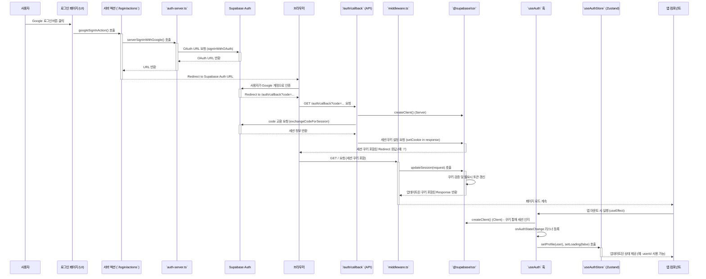

**문서: Backyard 애플리케이션 인증 처리 방식**

**최종 수정일:** 2025-05-06

**1. 이 프로젝트에서 인증을 처리하는 방법**

본 프로젝트는 **Supabase**를 주 인증 백엔드로 사용하며, **`@supabase/ssr`** 라이브러리를 활용하여 서버 렌더링(SSR), 서버 컴포넌트, 클라이언트 컴포넌트, 미들웨어 전반에 걸쳐 일관된 세션 관리를 구현합니다.

*   **인증 백엔드:** Supabase Auth (Google OAuth, Email/Password 등 지원)
*   **세션 관리:**
    *   `@supabase/ssr` 라이브러리가 쿠키 기반의 안전한 세션 관리를 담당합니다. 서버와 클라이언트 간 토큰 전달 및 갱신이 자동화됩니다.
    *   **`src/middleware.ts`**: 모든 요청 경로(특정 경로 제외)에 대해 실행되며, `@supabase/ssr`의 `updateSession` 유틸리티를 사용하여 접근/갱신 토큰을 자동으로 관리하고 최신 상태의 세션 쿠키를 유지합니다. 개발자는 토큰 관리에 직접 개입할 필요가 거의 없습니다.
*   **로그인/회원가입:**
    *   주로 **서버 액션(Server Actions)** (`src/app/login/actions.ts` 등)을 통해 처리됩니다.
    *   서버 액션은 `src/lib/supabase/server.ts`의 `createClient`를 사용하여 서버 측 Supabase 클라이언트를 생성하고, Supabase Auth 함수(예: `signInWithPassword`, `signInWithOAuth`)를 호출합니다.
    *   Google OAuth의 경우, 서버 액션이 Supabase로부터 OAuth URL을 받아 클라이언트로 전달하면, 클라이언트가 해당 URL로 리디렉션합니다.
*   **OAuth 콜백:**
    *   사용자가 외부 공급자(예: Google) 인증 후, `/auth/callback` 경로 (`src/app/auth/callback/route.ts`)로 리디렉션됩니다.
    *   이 라우트 핸들러는 서버 측 Supabase 클라이언트를 사용하여 전달된 인증 코드를 실제 사용자 세션으로 교환하고, `@supabase/ssr`이 응답 헤더에 세션 쿠키를 설정하도록 합니다. 이후 사용자는 일반적으로 홈페이지('/')로 리디렉션됩니다.
*   **클라이언트 상태 동기화:**
    *   **`src/hooks/useAuth.ts`**: 클라이언트 측에서 Supabase의 실시간 인증 상태 변경(`onAuthStateChange`) 이벤트를 구독(listen)하는 커스텀 훅입니다.
    *   **`src/store/useAuthStore.ts`**: `useAuth` 훅이 감지한 인증 상태 변경(로그인, 로그아웃 등)에 따라 사용자 프로필 정보(`profile`)와 로딩/에러 상태를 업데이트하는 **Zustand 스토어**입니다. 이것이 **클라이언트 측에서 인증 상태의 단일 진실 공급원(SSoT)** 역할을 합니다.

**2. 인증 처리 E2E (Google OAuth 예시)**



**3. 이 프로젝트에서 인증 정보(특히 `userId`)를 얻는 방법**

**가장 중요:** 일반적인 UI 컴포넌트에서는 `useAuth()` 훅을 **직접 호출하지 않습니다.**

`userId`나 다른 인증 관련 상태가 필요한 컴포넌트는 **반드시 `useAuthStore` (Zustand 스토어)를 통해 정보를 얻어야 합니다.**

*   **방법:** `useAuthStore` 훅과 **선택자(Selector) 함수**를 함께 사용합니다.

*   **코드 예시:**

    ```typescript
    import React from 'react';
    import { useAuthStore, selectUserId, selectIsLoading } from '@/store/useAuthStore';

    function ExampleComponent() {
      // 필요한 상태만 선택적으로 가져옵니다.
      const userId = useAuthStore(selectUserId);
      const isLoadingAuth = useAuthStore(selectIsLoading);

      if (isLoadingAuth) {
        return <p>인증 정보 로딩 중...</p>;
      }

      if (!userId) {
        return <p>로그인이 필요합니다.</p>;
      }

      // userId를 사용하는 로직
      return (
        <div>
          <p>로그인된 사용자 ID: {userId}</p>
          {/* userId를 사용하여 데이터 fetching 또는 다른 작업 수행 */}
        </div>
      );
    }

    export default ExampleComponent;
    ```

*   **이유:**
    *   **성능 최적화:** 선택자를 사용하면 스토어에서 필요한 상태 조각(`userId`)이 실제로 변경될 때만 컴포넌트가 리렌더링됩니다.
    *   **일관성:** 모든 컴포넌트가 동일한 SSoT(`useAuthStore`)를 참조하여 상태 불일치를 방지합니다.
    *   **단순성:** 컴포넌트는 복잡한 인증 로직이나 Supabase 이벤트 리스닝에 대해 알 필요 없이 필요한 상태만 가져다 쓰면 됩니다.

*   **서버 측:** 서버 컴포넌트, 서버 액션, API 라우트에서는 `src/lib/supabase/server.ts`의 `createClient()`와 `src/lib/auth-server.ts`의 `auth()` 함수를 사용하여 인증 정보를 얻습니다.