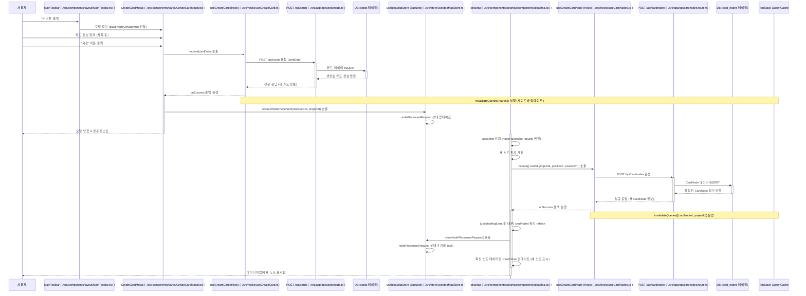

```mermaid
sequenceDiagram
    participant User as 사용자
    participant MT as MainToolbar (`./src/components/layout/MainToolbar.tsx`)
    participant CCM as CreateCardModal (`./src/components/cards/CreateCardModal.tsx`)
    participant UCC_Hook as useCreateCard (Hook) (`./src/hooks/useCreateCard.ts`)
    participant API_Cards as POST /api/cards (`./src/app/api/cards/route.ts`)
    participant DB_Cards as DB (cards 테이블)
    participant Store as useIdeaMapStore (Zustand) (`./src/store/useIdeaMapStore.ts`)
    participant IM as IdeaMap (`./src/components/ideamap/components/IdeaMap.tsx`)
    participant UCCN_Hook as useCreateCardNode (Hook) (`./src/hooks/useCardNodes.ts`)
    participant API_Nodes as POST /api/cardnodes (`./src/app/api/cardnodes/route.ts`)
    participant DB_Nodes as DB (card_nodes 테이블)
    participant TQ_Cache as TanStack Query Cache

    User->>+MT: "+" 버튼 클릭
    MT->>+CCM: 모달 열기 (placeNodeOnMap=true 전달)
    User->>CCM: 카드 정보 입력 (제목 등)
    User->>CCM: "저장" 버튼 클릭
    CCM->>+UCC_Hook: mutate(cardData) 호출
    UCC_Hook->>+API_Cards: POST /api/cards 요청 (cardData)
    API_Cards->>+DB_Cards: 카드 데이터 INSERT
    DB_Cards-->>-API_Cards: 생성된 카드 정보 반환
    API_Cards-->>-UCC_Hook: 성공 응답 (새 카드 정보)
    UCC_Hook-->>+CCM: onSuccess 콜백 실행
    Note over UCC_Hook, TQ_Cache: invalidateQueries(['cards']) 실행 (사이드바 업데이트)
    CCM->>Store: requestNodePlacement(newCard.id, projectId) 호출
    Store->>Store: nodePlacementRequest 상태 업데이트
    CCM-->>-User: 모달 닫힘 & 성공 토스트
    activate IM
    IM->>IM: useEffect 감지 (nodePlacementRequest 변경)
    IM->>IM: 새 노드 위치 계산
    IM->>+UCCN_Hook: mutate({ cardId, projectId, positionX, positionY }) 호출
    UCCN_Hook->>+API_Nodes: POST /api/cardnodes 요청
    API_Nodes->>+DB_Nodes: CardNode 데이터 INSERT
    DB_Nodes-->>-API_Nodes: 생성된 CardNode 정보 반환
    API_Nodes-->>-UCCN_Hook: 성공 응답 (새 CardNode 정보)
    UCCN_Hook-->>+IM: onSuccess 콜백 실행
    Note over UCCN_Hook, TQ_Cache: invalidateQueries(['cardNodes', projectId]) 실행
    IM->>IM: (useIdeaMapData 훅 내부) cardNodes 쿼리 refetch
    IM->>Store: clearNodePlacementRequest() 호출
    Store->>Store: nodePlacementRequest 상태 초기화 (null)
    IM->>IM: 최신 노드 데이터로 React Flow 업데이트 (새 노드 표시)
    deactivate IM
    IM-->>-User: 아이디어맵에 새 노드 표시됨
```